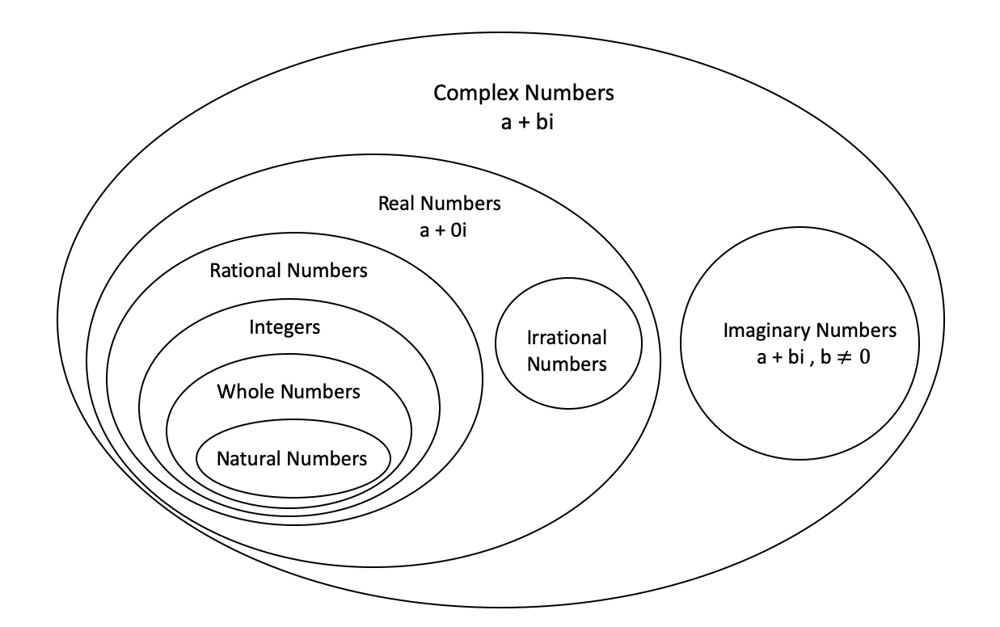
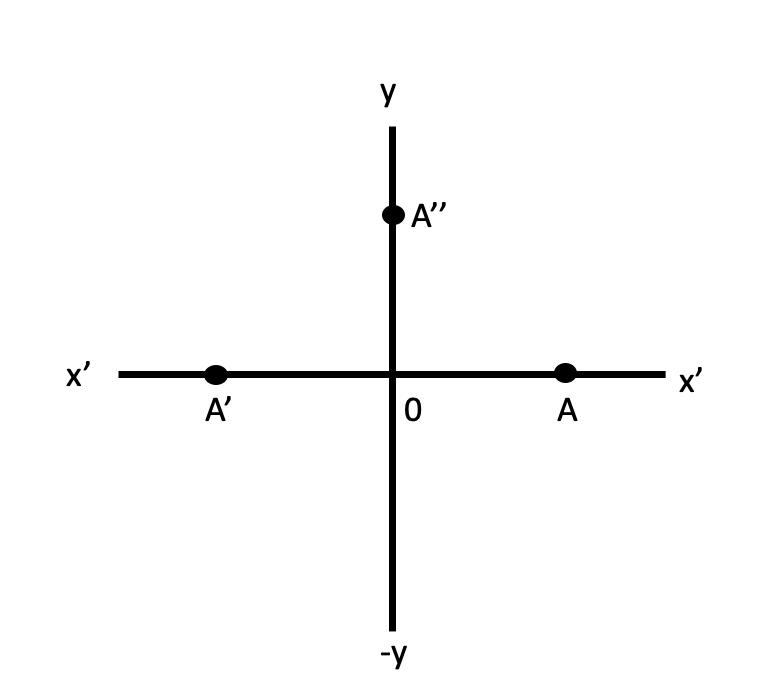

# Number Systems

```{r initial1, echo = FALSE, cache = FALSE, include = FALSE}
library(knitr)
opts_chunk$set(
  warning = FALSE,
  message = FALSE,
  echo = FALSE,
  fig.path = 'figure/',
  cache.path = 'cache/',
  fig.align = 'center',
  fig.show = 'hold',
  cache = TRUE,
  external = TRUE,
  dev = "png",
  fig.height = 16,
  fig.width = 10,
  out.width = "0.8\\textwidth"
)


library(tidyverse)
library(janitor)

```


Numbers can be classified according to how they are represented or according to the properties that they have.


## Main types


```{r   out.width = "100%", echo = FALSE, fig.align='center'}

```


### Complex numbers

- Every number in number system taken as a complex number
- A number of the form $a+ib$ is called a complex number when $a$ and $b$ are real numbers and $i=\sqrt{-1}$.
- We call '$a$' the real part and '$b$' the imaginary part of the complex number $a+ib$.
- IF $a=0$ the number $ib$ is said to be purely imaginary, if $b=0$ the number $a$ is real.
- A pair of complex number $a+ib$ and $a-ib$ are said to be conjugate of each other.
- Show that the sum and product of a complex number and its conjugate complex are both real.

Let $x+iy$ be a complex number and $x-iy$ its conjugate complex.

\[Sum = (x+iy)+(x-iy) = 2x\]    
\[Product = (x+iy).(x-iy) = x^{2}+y^{2}\]   

- Let  $a+ib$ and  $c+id$  be two complex numbers. Then

**Addition.** $(a+ib) +  (c+id)= (a+c)+i(b+d)$ 

**Subtraction** $(a+ib) -  (c+id)= (a-c)+i(b-d)$ 

**Multiplication** $(a+ib) \times (c+id)= ac-bd+i(ad+bc)$ 

**Addition.** $\frac{a+ib}{c+id}= \frac{a+ib}{c+id}.\frac{c-id}{c-id}= \frac{ac+bd}{c^2+d^2}+i\frac{bc-ad}{c^2+d^2}$ 

- Complex numbers are denoted by $\mathbb{C}$

### Imaginary numbers

- A number does not exist in the number line is called imaginary number. 
- For example square root of negative numbers are imaginary numbers. It is denoted by $i$.
i.e \[\sqrt{-1}=i\] \newline
    \[i^{2} = – 1\]
- So there is no real number $i$ that satisfies the above equation. 
- The quantity $i$ is called the unit imaginary number.

**Geometrical Representation of imaginary numbers**

```{r   out.width = "50%", echo = FALSE, fig.align='center'}

```


- Let OA be positive numbers which is represented by $x$ and $OA^\prime$ by $-x$
- And $-x= (i)^2x=i(ix)$ is on $OX^{\prime}$
- It means that the multiplication of the real number $x$ by $i$ twice  amounts to the rotation of OA through two right angles to reach $OA^\prime$.
- Thus, it means that multiplication of $x$ by $i$ is equivalent to the rotation of $x$ through one right angle to reach  $OA^{\prime\prime}$.
- Hence, y-axis is known as imaginary axis.
- Multiplication by $i$ rotates its direction through  right angle. 


### Real numbers

- All numbers that can be represented on the number line are called real numbers.
- The real numbers is the set of numbers containing all of the rational numbers and all of the irrational numbers. 
- The real numbers are "all the numbers" on the number line.
- Real Numbers are denoted by $\mathbb{R}$.

### Rational numbers

- $\mathbb{Q}$
- A rational number is defined as number of the form $x/y$ where $x$ and $y$ are integers and $y \neq 0$.
- i.e Any number which can be expressed as in the form of $p/q$ where $p$ and $q$ are the integers and $q \neq 0$.
- The set of rational numbers encloses the set of integers and fractions.
- The rational numbers that are not integral will have decimal values. These values can be of two types
 
    - Terminating decimal fractions (finite decimal factors): For example $1/5 = 0.5$ , $13/5 = 2.6$.
    - Non Terminating decimal fractions : The non terminating decimal fractions having two types.
         i) Non terminating periodic fractions
         ii) Non terminating non periodic fractions

*i) Non terminating periodic fractions* 

a. These are non terminating decimal fractions of the type $a.b1b2b3b4b5 .....bmb1b2b3b4b5 .....bm$
b. Examples

   $19/6 = 3.16666666.....$ 

   $18/7 = 2.57142857142857.......$ 

   $21/9= 2.3333.......$ 

*ii) Non terminating non periodic fractions*

a. These are non terminating and there is no periodic decimal places for that number. 
b. i.e $a.b1b2b3b4b5 .....bmc1c2.........$
c. for example 6.789542587436512..........


- **So from above terminating and non terminating periodic fraction numbers belongs to rational numbers.**


### Irrational numbers

- Irrational numbers are denoted by $\mathbb{I}$
- An Irrational numbers are non terminating and non periodic fractions.
- i.e irrational number is a number that cannot be written as a ratio $x/y$ form (or fraction). 
- In decimal form, is never ends or repeats.
- Examples for irrational numbers are $\sqrt{2} = 1.414213......$, $\pi = 3.14159265.......$, $\sqrt{3}$, $\sqrt{5}$ etc.

### Integers

- All numbers that do not having the decimal places in them are called integers. 
- All whole numbers including Negative number + Positive number
- $\mathbb{Z} = \{...,-5,-4,-3,-2,-1,0,1,2,3,4,5,...\}$
- i.e the integer it may positive or negative or zero.
- The set of integers generally written $\mathbb{Z}$for short.
- Any integers are added, subtracted, or multiplied the result is always is an integer.
- When any integers multiplied , each of the multiplied integer is called a factor or divisor of the resulting product

### Whole numbers

- The set of whole numbers means narrator numbers and $0$
- Whole numbers =  $\mathbb{W} = \{ 0,1,2,3,4,5,6,7,8,...\}$


### Natural numbers

- The counting numbers start with 1 and their end is not defined. Generally it is denoted by “N”
- i.e $\mathbb{N} =\{1,2,3,4,...\}$

**Reading :**

Dass, H. K. (2008). 'Complex Numbers', *Advanced Engineering Mathematics*. S. Chand Publishing.  pp. 474-520.

## Number representations

Decimal: The standard Hindu–Arabic numeral system using base ten.

Binary: The base-two numeral system used by computers.

Hexadecimal: Widely used by computer system designers and programmers, as they provide a more human-friendly representation of binary-coded values.

Octal: Occasionally used by computer system designers and programmers.

Duodecimal: The most convenient numeral system, due to twelve's divisibility by a wide range of the most elemental numbers {1, 2, 3, 4}.

Sexagesimal: Originated with the ancient Sumerians in the 3rd millennium BC, was passed down to the ancient Babylonians

(See positional notation for information on other bases)

Roman numerals: The numeral system of ancient Rome, still occasionally used today.

Tally marks: usually used for counting things that increase by small amounts and don't change very quickly.

Fractions: A representation of a non-integer as a ratio of two integers. These include improper fractions as well as mixed numbers.

Continued fraction: An expression obtained through an iterative process of representing a number as the sum of its integer part and the reciprocal of another number, then writing this other number as the sum of its integer part and another reciprocal, and so on.

Scientific notation: A method for writing very small and very large numbers using powers of 10. When used in science, such a number also conveys the precision of measurement using significant figures.

Knuth's up-arrow notation, Conway chained arrow notation, and Bowers's operators : Notations that allow the concise representation of some extremely large integers such as Graham's number.


https://en.wikipedia.org/wiki/List_of_types_of_numbers

https://byjus.com/maths/number-system/

https://www.researchgate.net/publication/320677641_Number_System

http://www.compsci.hunter.cuny.edu/~sweiss/resources/BinaryNumbers.pdf

https://www.cs.bu.edu/courses/cs101a1/slides/CS101.Lect15.BinaryNumbers.ppt.pdf

https://www.eecs.wsu.edu/~ee314/handouts/numsys.pdf

http://www.uobabylon.edu.iq/eprints/publication_3_8400_6187.pdf

https://www.cs.princeton.edu/courses/archive/spr15/cos217/lectures/03_NumberSystems.pdf

[Number system is used in IT applications](https://www.ukessays.com/essays/social-work/number-system-is-used-in-it-applications-social-work-essay.php)

- Number Systems [ Rational, irrational numbers](https://www.topperlearning.com/ncert-solutions/cbse-class-9-mathematics/mathematics-ix/number-systems)