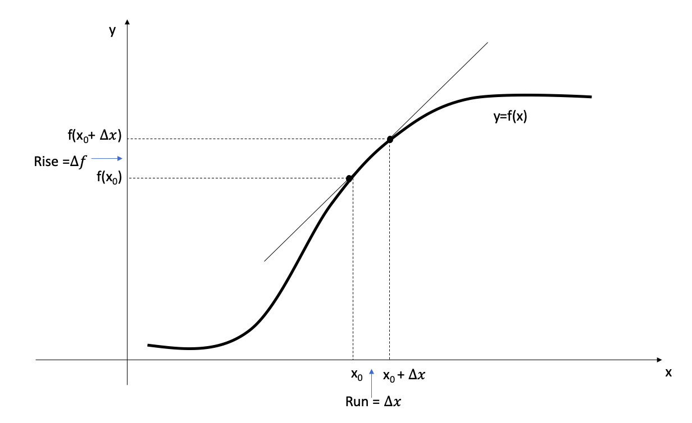
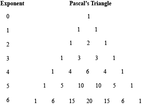
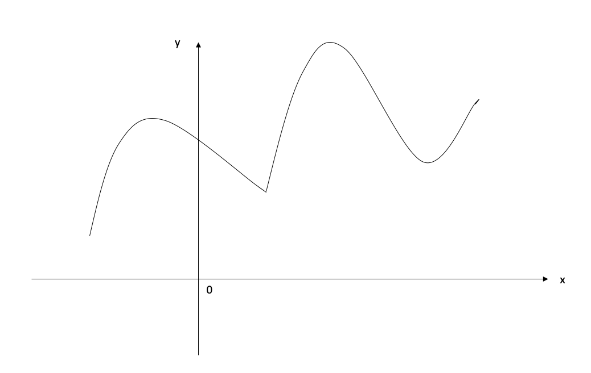
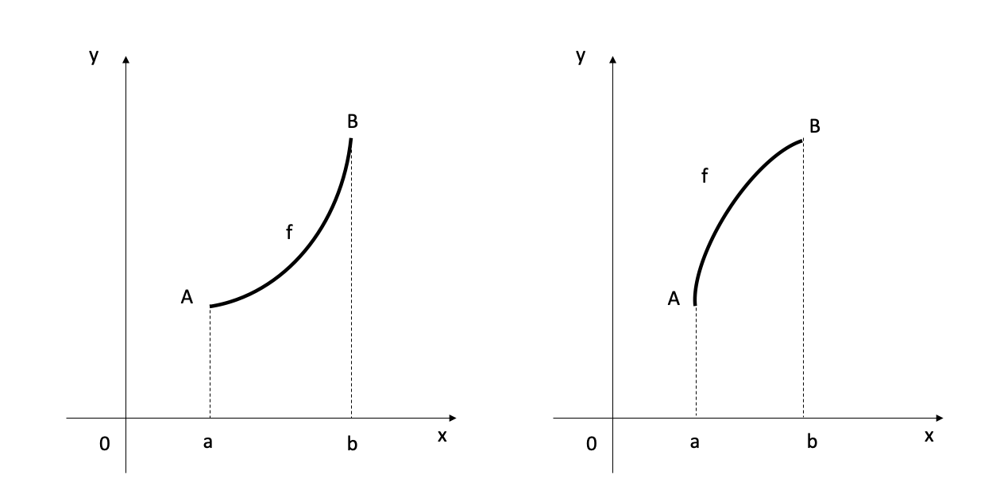
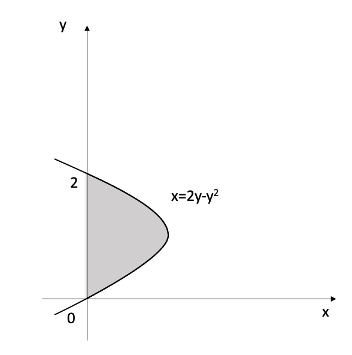

# Differentiation and Integration

<!--  Differentiation (hard copy available): Shenk, A. (1988). Calculus and analytic geometry. Scott Foresman & Company.-->

<!--Stewart, J. (2003). Calculus: Early Transcendentals. Thomson Learning. Inc., Belmont, CA.-->

<!-- Factorization https://en.wikipedia.org/wiki/Factorization-->

```{r initial5, echo = FALSE, cache = FALSE, include = FALSE}
library(knitr)
opts_chunk$set(
  warning = FALSE,
  message = FALSE,
  echo = FALSE,
  fig.path = 'figure/',
  cache.path = 'cache/',
  fig.align = 'center',
  fig.show = 'hold',
  cache = FALSE,
  external = TRUE,
  dev = "png",
  fig.height = 16,
  fig.width = 10,
  out.width = "0.8\\textwidth"
)


library(tidyverse)

```

\pagenumbering{arabic}

## Limits (Summary) {-}
<!-- page 93 stewart-->

### The limit of a function {-}

**Definition 1** 

We write  $$lim_{x\to a}f(x)=L$$ and say "the limit of $f(x)$, as $x$ approaches $a$, equals $L$"

if we can make the values of $f(x)$ arbitrarily close to $L$ (as close to $L$ as we like) by taking $x$ to be sufficiently close to $a$ (**on either side of** $a$) but not equal to $a$

### One-sided limits {-}

**Definition 2**

We write 

$$lim_{x\to a^-}f(x)=L$$
and say the **left-hand limit of** $f(x)$ **as** $x$ **approaches** $a$ [or the **limit of** $f(x)$ **as** $x$ **approaches** $a$ **from the left**] is equal to $L$ if we can make the values of $f(x)$ arbitrarily close to $L$ by taking $x$ to be sufficiently close to $a$ and $x$ less than $a$.

Notice that Definition 2  differs from Definition 1 only in that we require $x$ to be less than $a$. 

Similarly, if we require that $x$ be grater than  $a$, we get "the **right-hand limit of** $f(x)$ **as** $x$ **approaches** $a$ is equal to $L$"  and we write 
$$lim_{x\to a^+}f(x)=L$$

### Relationship between the limit and one-side limits

$$lim_{x\to a}f(x)=L \;\;\;\text{if and only if }\;\;\; lim_{x\to a^-}f(x)=L \;\;\text{and}\;\; lim_{x\to a^+}f(x)=L$$


That is,
$$lim_{x\to a}f(x)=L \Rightarrow  lim_{x\to a^-}f(x)= lim_{x\to a^+}f(x)=L$$
$$lim_{x\to a^-}f(x)= lim_{x\to a^+}f(x)=L \Rightarrow lim_{x\to a}f(x)=L$$
$$lim_{x\to a^-}f(x) \ne lim_{x\to a^+}f(x) \Rightarrow lim_{x\to a}f(x) \text{ Does Not Exist }$$


### Properties {-}

Assume $lim_{x\to a}f(x)$ and $lim_{x\to a}g(x)$ both exist and $c$ is any number then, 

1. $lim_{x\to a}[cf(x)] = c\;lim_{x\to a}f(x)$

2. $lim_{x\to a}[f(x) \pm g(x)] = lim_{x\to a}f(x) \pm lim_{x\to a}g(x)$

3. $lim_{x\to a}[f(x)g(x)] = lim_{x\to a}f(x)  lim_{x\to a}g(x)$

4. $lim_{x\to a}\left[\frac{f(x)}{g(x)}\right] = \frac{lim_{x\to a}f(x)}{lim_{x\to a}g(x)}$ provided $lim_{x\to a}g(x) \ne 0$

5. $lim_{x\to a}[f(x)]^n = [lim_{x\to a}f(x)]^n$

<!-- pg 124-->

### Continuous functions {-}

**Definition3**

A function $f$ is **continuous at a number** $a$ if 

$$lim_{x\to a}f(x)=f(a)$$

Notice that Definition 3 implicitly requires three things if $f$ is continuous at $a$:

1. $f(a)$ is defined (that is, $a$ is in the domain of $f$)
2. $lim_{x\to a}f(x)$ exits
3. $lim_{x\to a}f(x) = f(a)$


\newpage

## Differentiation 

### Derivative and tangent lines

#### Geometric meaning of the derivative

- The steepness of a line can be determined by its *slope*.
- The steepness of the graph of a function ($f$) at a given point on it (say $(x_0, f{(x_0)})$), can be approximated by its **tangent line** at that point. 
- The slope of the tangent line at a point on the function is equal to the derivative of the function at that point 
- *The derivative of $f$ at $x_0$*  is denoted by $f^\prime (x_0)$  

```{r   out.width = "70%", echo = FALSE, fig.align='center'}
knitr::include_graphics("figure/5Derivatives-1.png")
```


- The direct computation of the slope of the tangent line is not possible as we are given only one point $(x_0, f{(x_0)})$.
- Instead,  we consider the **secant line** through two points: $(x_0, f{(x_0)})$ and $(x, f{(x)})$, on the graph of $f$.


```{r   out.width = "70%", echo = FALSE, fig.align='center'}
knitr::include_graphics("figure/5Derivatives-2.png")
```

- As $x$ approaches $x_0$, the secant line is approaching to the tangent line. 
- As $x$ varies, the secant line turns about the fixed point  $(x_0, f{(x_0)})$. 
- We can describe the tangent line as the limiting line of the secant line when $x$ approaches $x_0$ from either direction. 

```{r   out.width = "70%", echo = FALSE, fig.align='center'}
knitr::include_graphics("figure/5Derivatives-3.png")
```

- As we move on the secant line from $(x_0, f{(x_0)})$ to $(x, f{(x)})$
   - the rise is $f(x) - f(x_0)$
   - the run is $x - x_0$.
- Therefore, 
$$\text{The slope of the secant line} = \frac{f(x) - f(x_0)}{x - x_0} \text{ for } x\neq x_0.$$
- To have the derivative be the slope of the tangent line, we define it as the limit of the slope of the secant line.

**Definition 1: Tangent line **

**The tangent line to the curve $f$ at the point $(x_0, f(x_0))$ is the line through that point with slope** $$m = lim_{x\to x_{0}}\frac{f(x)-f(x_0)}{x-x_0}$$

**provided that this limit exists**


**Definition 2**

**The derivative of a function $f$  at $x_0$ is**
$$f^{\prime}(x_0) = lim_{x\to x_{0}}\frac{f(x) - f(x_0)}{x-x_0}$$
**provided this limit exists and is finite.**


- If this limit does not exist or if it is infinite, we say that **$f$ does not have a derivative at $x_{0}$**

\newpage

*Example 1*
Compute the derivative of the function $x^2$ at $x=1$, using the definition of derivative

```{r Devbox1a, out.width='100%', fig.asp=.9, fig.align='center', fig.pos='h'}
library(ggplot2)

ggplot()+
  theme_void()+
  theme(panel.border = element_rect(colour = "white", fill=NA, size=1))

```

\newpage

**The geometric interpretation of the above solution**

```{r   out.width = "100%", echo = FALSE, fig.align='center'}
knitr::include_graphics("figure/5Derivatives-4.png")
```

- The derivative is the slope of the tangent line to the graph at the point $(1,1)$. ( $f^\prime(1) = 2$)
- The secant line has slope $x+1$, and the limit of that slope as x tends to 1 is the slope 2 of the tangent line


#### Equations of the tangent lines


- When we compute the derivative, $f^\prime(x_0)$, we can give an equation for the tangent line at $(x_0, f(x_0))$ on the graph of $f$.
- The tangent line has the equation $$y-f(x_0)= f^\prime(x_0)(x-x_0)$$


\newpage

*Example 2*

Give the equation for the tangent line to the parabola $y=x^2$ at $x=1$.

```{r Devbox2, out.width='100%', fig.asp=.5, fig.align='center', fig.pos='h'}
library(ggplot2)

ggplot()+
  theme_void()+
  theme(panel.border = element_rect(colour = "white", fill=NA, size=1))

```


#### Important properties

**1. Differentiable functions are continuous**

- A function must be continuous at any point where it has a derivative.

\newpage

**Theorem**

**If the derivative $f^\prime(x_0)$ exists, then the function $f$ is continuous at $x_{0}$.**

<!--The converse of Theorem 4 is false-->

```{r Devbox3, out.width='100%', fig.asp=.95, fig.align='center', fig.pos='h'}
library(ggplot2)

ggplot()+
  theme_void()+
  theme(panel.border = element_rect(colour = "white", fill=NA, size=1))

```

**2. Continuous functions that do not have derivative**

-  The converse of the above theorem is false; that is, there are  functions that are continuous but not differentiable. 

- This usually occurs in one of the two ways:

\newpage

1. When the graph of $f$ has a vertical tangent line at a given point. (The slope of the secant line $\frac{f(x) - f(x_0)}{x-x_0}$ tends to $\infty$ or to $-\infty$ as $x$ tends to $x_0$)


```{r   out.width = "100%", echo = FALSE, fig.align='center'}
knitr::include_graphics("figure/5Derivatives-6.png")
```

2. When the secant line has different limits as $x$ tends to $x_0$ from the left and from the right (i.e. when the graph has a sharp corner or a cusp at $x=x_0$).


```{r   out.width = "100%", echo = FALSE, fig.align='top'}
knitr::include_graphics("figure/5Derivatives-7.png")
```


\newpage

The graph of a function will not have a tangent line at a point where the function is discontinuous.

```{r   out.width = "100%", echo = FALSE, fig.align='center'}
knitr::include_graphics("figure/5Derivatives-5.png")
```

- This graph does not have a tangent line at $x=x_{0}$
- Therefore, the function $f$ does not have a derivative at $x_{0}$.


\newpage

**5.1.2 Leibniz notation  and derivative as a function**

```{r  out.width = "100%", echo = FALSE, fig.align='center', fig.cap="Isaac Newton and Gottfried Leibniz"}

```

\newpage 


### Leibniz notation  and derivative as a function

- In the Leibniz notation the derivative of $f$ at $x_0$ is denoted by the symbol $\frac{df}{dx}(x_0)$

- With Leibniz notation the definition of the derivative reads

$$\frac{df}{dx}(x_0)= lim_{x\to x_{0}}\frac{f(x)-f(x_0)}{x-x_0}$$

We set $\Delta x = x-x_0.$

Then $x = x_0+ \Delta x$.

Let $\Delta f$ for the change $f(x_0 + \Delta x) - f(x_0)$ in the value of $f$ that occurs  when we change $x$ by $\Delta x$ from $x_0$ to $x_0+\Delta x$

```{r out.width = "70%", echo = FALSE, fig.align='center'}

```

Then the slope of the secant line takes the form

$$\frac{f(x_0 +\Delta x)-f(x_0)}{\Delta x }= \frac{\Delta f}{\Delta x}.$$

Now the definition of the derivative reads 

$$\frac{df}{dx} (x_0) = lim_{\Delta x\to 0}\frac{\Delta f}{\Delta x}= lim_{\Delta x\to 0} \frac{f(x_0 +\Delta x)-f(x_0)}{\Delta x }$$


\newpage

*Example 3*

Use the above definition of the derivative to compute $\frac{df}{dx}(3)$ where $f(x)=x^2$

```{r LB1, out.width='100%', fig.asp=.9, fig.align='center', fig.pos='h'}
library(ggplot2)

ggplot()+
  theme_void()+
  theme(panel.border = element_rect(colour = "white", fill=NA, size=1))

```

#### The derivative as a function

- So far we considered derivatives at a given value of x

- If we consider the derivative at a **variable** $x$, we get *the derivative function* $\frac{df}{dx}$ whose value $\frac{df}{dx}(x)$ is the slope of the tangent line to the graph of f at the point $(x, f(x)).$

$$\frac{df}{dx}(x) =lim_{\Delta x\to 0}\frac{f(x+\Delta x) -f(x)}{\Delta x}$$


### Derivatives of polynomials and exponential functions 


#### Derivative of a constant function

$$\frac{d}{dx}(c) = 0$$

```{r LB2, out.width='100%', fig.asp=.9, fig.align='center', fig.pos='h'}
library(ggplot2)

ggplot()+
  theme_void()+
  theme(panel.border = element_rect(colour = "white", fill=NA, size=1))

```


#### Power functions

- We now look at the functions $f(x) = x^n$.


**Pascal's Triangle and the Binomial Theorem**

*Binomial Expansions Using Pascal's Triangle*

Consider the following expanded powers of $(a + b)^n$, where $a + b$ is any binomial and $n$ is a whole number. Look for patterns.

$(a+b)^0 = 1$

$(a+b)^1 = a+b$

$(a+b)^2 = a^2+2ab+b^2$

$(a+b)^3 = a^3+3a^2b+3ab^2+b^3$

$(a+b)^4 = a^4+4a^3b+6a^2b^2+4ab^3+b^4$

$(a+b)^5 = a^5+5a^4b+10a^3b^2+10a^2b^3+5ab^4+b^5$

Each expansion is a polynomial. 

<!--There are some patterns to be noted.-->

- Blaise Pascal found a numerical pattern, called **Pascal's Triangle**

```{r  out.width = "70%", echo = FALSE, fig.align='center'}

```

- Pascal's Triangle gives us the coefficients for an expanded binomial of the form $(a + b)^n$, where $n$ is the row of the triangle. 


**Binomial Theorem**
  
  - According to the Binomial Theorem, if $a$ and $b$ are any real numbers and $k$ is a positive integer, then

$$(a+b)^n = a^n + na^{n-1}b+\frac{n(n-1)}{2!}a^{n-2}b^2+
  \frac{n(n-1)(n-2)}{3!}a^{n-3}b^3 +$$

$$\dots + \frac{n(n-1)(n-2)\dots (n-k+1)}{n!}a^{n-k}b^k + \dots + nab^{n-1}+b^n$$
  
The traditional notation for the binomial coefficients is
$${n \choose 0}=1$$
  
$${n \choose k}=\frac{n(n-1)(n-2)\dots (n-k+1)}{k!}$$  $n=1,2,\dots, k$
    
which enables us to write the Binomial Theorem in the abbreviated form 
  
  $$(a+b)^n = \sum_{k=0}^n {n \choose k }a^{n-k}b^k = \sum_{k=0}^n {n \choose k }a^{k}b^{n-k}.$$
   
   
*Example 1*
    
$f(x)=x$
      
```{r LB3, out.width='100%', fig.asp=.9, fig.align='center', fig.pos='h'}
ggplot()+
      theme_void()+
      theme(panel.border = element_rect(colour = "white", fill=NA, size=1))
    
```
    
\newpage
    
*Example 2*
      
$f(x)=x^2$
      
```{r LB4, out.width='100%', fig.asp=.9, fig.align='center', fig.pos='h'}
ggplot()+
      theme_void()+
      theme(panel.border = element_rect(colour = "white", fill=NA, size=1))
    
```
    
\newpage
    
*Example 3*
      
$f(x)=x^3$
      
```{r LB5, out.width='100%', fig.asp=.9, fig.align='center', fig.pos='h'}
ggplot()+
      theme_void()+
      theme(panel.border = element_rect(colour = "white", fill=NA, size=1))
    
```
    
\newpage

*Example 4*
      
$f(x)=x^4$
      
```{r LB6, out.width='100%', fig.asp=.9, fig.align='center', fig.pos='h'}
ggplot()+
      theme_void()+
      theme(panel.border = element_rect(colour = "white", fill=NA, size=1))
    
```
     
     
**The Power Rule**
      
If $n$ is a positive integer, then
    
$$\frac{d}{dx}(x^n)=nx^{n-1}$$
      
```{r LB7, out.width='100%', fig.asp=.9, fig.align='center', fig.pos='h'}
ggplot()+
      theme_void()+
      theme(panel.border = element_rect(colour = "white", fill=NA, size=1))
  
```
    
*Functions with negative integer exponents*
      
*Example 5*
      
$f(x)=\frac{1}{x}$
      
```{r LB8, out.width='100%', fig.asp=.9, fig.align='center', fig.pos='h'}
    
    ggplot()+
      theme_void()+
      theme(panel.border = element_rect(colour = "white", fill=NA, size=1))
    
```
    
*When the  exponent is a fraction*
      
*Example 6*
      
$f(x)=\sqrt{x}$
      
```{r LB9, out.width='100%', fig.asp=.9, fig.align='center', fig.pos='h'}
ggplot()+
      theme_void()+
      theme(panel.border = element_rect(colour = "white", fill=NA, size=1))
    
```


**The Power Rule (General version)**
      
If $n$ is any real number, then
    
$$\frac{d}{dx}(x^n)=nx^{n-1}$$
      
#### The constant multiple rule
      
If $c$ is a constant and $f$ is a differentiable function, then
    
$$\frac{d}{dx}[cf(x)]= c\frac{d}{dx}f(x)$$

\newpage 

```{r LB10, out.width='100%', fig.asp=.7, fig.align='center', fig.pos='h'}
library(ggplot2)
ggplot()+
      theme_void()+
      theme(panel.border = element_rect(colour = "white", fill=NA, size=1))
    
```

*Example 7*
      
$f(x)=3x^4$

```{r LB11, out.width='100%', fig.asp=.7, fig.align='center', fig.pos='h'}

library(ggplot2)
ggplot()+
      theme_void()+
      theme(panel.border = element_rect(colour = "white", fill=NA, size=1))
    
```


#### The Sum Rule

If $f$ and $g$  are both differentiable, then

$$\frac{d}{dx}[f(x)+g(x)]= \frac{d}{dx}f(x)+ \frac{d}{dx}g(x)$$
  
  
```{r LB12, out.width='100%', fig.asp=.7, fig.align='center', fig.pos='h'}
library(ggplot2)
ggplot()+
  theme_void()+
  theme(panel.border = element_rect(colour = "white", fill=NA, size=1))

```

- The Sum Rule is applicable to the sum of any number of functions

\vspace{6pt}

#### The Difference Rule

If $f$ and $g$  are both differentiable, then

$$\frac{d}{dx}[f(x)-g(x)]= \frac{d}{dx}f(x)- \frac{d}{dx}g(x)$$
  
  - The Constant Multiple Rule, the Sum Rule and the Difference Rule can be combined with the Power Rule to differentiate any polynomial. 

\newpage

*Example 8*
  
  a) Differentiate $f(x)=x^4 - 6x^2+4$
  
  b) Find the points on the curve $f(x)=x^4-6x^2+4$ where the tangent line is horizontal
  
  
```{r LB13, out.width='100%', fig.asp=1, fig.align='center', fig.pos='h'}
library(ggplot2)
ggplot()+
  theme_void()+
  theme(panel.border = element_rect(colour = "white", fill=NA, size=1))

```

\newpage

#### Exponential Functions

*Exercise:*

Compute the derivative of the exponential function $f(x) = a^x$ using th definition of a derivative


  
```{r LB14, out.width='100%', fig.asp=1, fig.align='center', fig.pos='h'}
library(ggplot2)
ggplot()+
  theme_void()+
  theme(panel.border = element_rect(colour = "white", fill=NA, size=1))

```


**Definition: Definition of the number** $e$

$e$ is the number such that 

$$lim_{h\to 0}\frac{e^h -1}{h}=1$$

- If we put $a=e$ and , then, $f^\prime(0)=1$.

- Then **derivative of the Natural Exponential Function**
$$\frac{d}{dx}(e^x)= e^x$$

- Therefore, the exponential function, $f(x) = e^x$ has the property that it is its own derivative.

- Geometrically, this means that  the slope of the tangent line to the curve $f(x) = e^x$ is equal to the y-coordinate of the point. 

*Example 9*
  
If $f(x)=e^x-x$, find $f^\prime(x)$

  
```{r LB15, out.width='100%', fig.asp=1, fig.align='center', fig.pos='h'}
library(ggplot2)
ggplot()+
  theme_void()+
  theme(panel.border = element_rect(colour = "white", fill=NA, size=1))

```

```{r LB16, out.width='80%', fig.asp=.75, fig.align='center', fig.pos='h'}
library(ggplot2)

x <- seq(-2,2,0.1)
y1 <- exp(x) -x
y2 <- exp(x) -1

data <- data.frame(x,y1,y2)
p<- data %>%
  ggplot(aes(x, y1))+
  geom_line() +
  geom_text(data = data[10,],aes(label = "f(x)"), vjust = "inward", hjust = "inward", size =12)+
  #geom_text(data = data[3,], aes(x=x, y=y1), "f(x)")+
  labs(x="", y="") +
  geom_line(data =data, aes(x=x, y=y2), colour= "red")+
  geom_text(data = data[10,c("x", "y2")],aes(x=x, y=y2 ,label = "f'(x)"), vjust = "inward", hjust = "inward", colour = "red", size =12)+
  geom_hline(yintercept= 0)+
  geom_vline(xintercept= 0)+
  theme( aspect.ratio = 1)
print(p)
```

### The product and quotient rules

#### The product rule


If $f$and $g$ are both differentiable, then

$$\frac{d}{dx}[f(x)g(x)]= f(x)\frac{d}{dx}[g(x)]+ g(x)\frac{d}{dx}[f(x)]$$
 
```{r LB17, out.width='100%', fig.asp=0.9, fig.align='center', fig.pos='h'}
library(ggplot2)
ggplot()+
  theme_void()+
  theme(panel.border = element_rect(colour = "white", fill=NA, size=1))

```

*Example 10*
  
If $f(x)=xe^x$, find $f^\prime(x)$

  
```{r LB18, out.width='100%', fig.asp=0.6, fig.align='center', fig.pos='h'}
library(ggplot2)
ggplot()+
  theme_void()+
  theme(panel.border = element_rect(colour = "white", fill=NA, size=1))

```

#### The quotient rule
 
 
If $f$and $g$ are both differentiable, then

$$\frac{d}{dx}[\frac{f(x)}{g(x)}]= \frac{g(x)\frac{d}{dx}[f(x)]- f(x)\frac{d}{dx}[g(x)]}{[g(x)]^2}$$
 
```{r LB19, out.width='100%', fig.asp=0.9, fig.align='center', fig.pos='h'}
library(ggplot2)
ggplot()+
  theme_void()+
  theme(panel.border = element_rect(colour = "white", fill=NA, size=1))

```

*Example 11*
  
If $f(x)=\frac{x^2+x-2}{x^3+6}$, find $f^\prime(x)$

  
```{r LB20, out.width='100%', fig.asp=0.9, fig.align='center', fig.pos='h'}
library(ggplot2)
ggplot()+
  theme_void()+
  theme(panel.border = element_rect(colour = "white", fill=NA, size=1))

```

<!--
### Machine learning use cases

<!--https://ml-cheatsheet.readthedocs.io/en/latest/calculus.html#derivatives-->
    
### The chain rule

If $y=f(u)$ and $u=g(x)$ are both differentiable functions, then

$$\frac{dy}{dx} = \frac{dy}{du}\frac{du}{dx} $$
 
 
 
```{r LB21, out.width='100%', fig.asp=0.9, fig.align='center', fig.pos='h'}
library(ggplot2)
ggplot()+
  theme_void()+
  theme(panel.border = element_rect(colour = "white", fill=NA, size=1))

```


*Example 12*
  
If $f(x)=\sqrt{x^2+1}$, find $f^\prime(x)$ using chain rule.

  
```{r LB22, out.width='100%', fig.asp=0.6, fig.align='center', fig.pos='h'}
library(ggplot2)
ggplot()+
  theme_void()+
  theme(panel.border = element_rect(colour = "white", fill=NA, size=1))

```
    
#### The power rule combined with the chain rule

If $n$ is any real number and $u=g(x)$ is differentiable, then

$$\frac{d}{dx}(u^n)= nu^{n-1}\frac{du}{dx}$$

Alternatively,

$$\frac{d}{dx}([g(x)]^n)= n[g(x)]^{n-1}\frac{d}{dx}g(x)$$
  
  
```{r LB23, out.width='100%', fig.asp=0.6, fig.align='center', fig.pos='h'}
library(ggplot2)
ggplot()+
  theme_void()+
  theme(panel.border = element_rect(colour = "white", fill=NA, size=1))

```


*Example 13*
  
If $f(x)=(x^3-2)^{100}$, find $f^\prime(x)$

  
```{r LB24, out.width='100%', fig.asp=0.6, fig.align='center', fig.pos='h'}
library(ggplot2)
ggplot()+
  theme_void()+
  theme(panel.border = element_rect(colour = "white", fill=NA, size=1))

``` 


*Example 14*
  
If $f(x)=\frac{1}{(x^2+x+1)^{1/3}}$, find $f^\prime(x)$

  
```{r LB25, out.width='100%', fig.asp=0.6, fig.align='center', fig.pos='h'}
library(ggplot2)
ggplot()+
  theme_void()+
  theme(panel.border = element_rect(colour = "white", fill=NA, size=1))

``` 

### Partial Derivatives

<!-- Page 911 Stewart-->

If $f$ is a function of two variables, its **partial derivatives** are the functions $f_x$ and $f_y$ defined by 

$$f_x=f_x(x,y)=lim_{h\to 0}\frac{f(x+h,y)-f(x,y)}{h}$$
 
$$f_y=f_y(x,y)=lim_{h\to 0}\frac{f(x,y+h)-f(x,y)}{h}$$ 


- There are many alternative notations for partial derivatives.

- Instead of $f_x$, it can be written as $f_1$ or $D_1f$ to indicate that the differentiation is with respect to the *first* variable.

- Another notation is $\frac{\partial f}{\partial x}$. 

- But here $\frac{\partial f}{\partial x}$ can't be interpreted as a ratio of differentials.

\newpage

**Notations for Partial Derivatives**

If $z=f(x,y),$  we write

$$f_x=f_x(x,y)= \frac{\partial f}{\partial x}= \frac{\partial }{\partial x}f(x,y)= \frac{\partial z }{\partial x}= f_1=D_1f= D_xf $$

$$f_y=f_y(x,y)= \frac{\partial f}{\partial y}= \frac{\partial }{\partial y}f(x,y)= \frac{\partial z }{\partial y}= f_2=D_2f= D_yf $$


- The partial derivative with respect to $x$ is just the *ordinary* derivative of the function of a single variable that we get by keeping $y$ fixed.

- Therefore, we have the following rule.

**Rule for finding Partial Derivatives of ** $z=f(x,y)$

1. To find $f_x$, regard $y$ as a constant and differentiate $f(x,y)$ with respect to $x$.

2. To find $f_y$, regard $x$ as a constant and differentiate $f(x,y)$ with respect to $y$.


*Example 15*
  
If $f(x,y)=x^3+x^2y^3-2y^2$, find $f_x(2,1)$ and $f_y(2,1)$

  
```{r LB25b, out.width='100%', fig.asp=0.9, fig.align='center', fig.pos='h'}
library(ggplot2)
ggplot()+
  theme_void()+
  theme(panel.border = element_rect(colour = "white", fill=NA, size=1))

``` 

### Higher Derivatives

- If $f$ is a differentiable function, then its derivative $f^\prime$ is also a function.

- It is denoted by $(f^\prime)^\prime = f^{\prime\prime}$.

- This $f^{\prime\prime}$ is called the **second derivative** of $f$ as it is the derivative of the derivative of $f$. 

- Using Leibniz notation we can write the second derivative of $f$ as follows:

$$\frac{d}{dx}(\frac{dy}{dx})= \frac{d^2y}{dx^2}$$
   
- Another notation is $f^{\prime\prime}= D^2f(x)$.

- We can interpret $f^{\prime\prime}$ as the slope of the curve $y=f^{\prime}(x)$ at the point $(x, f^\prime(x))$. 

- In other words, it is the rate of change of the slope of the original curve $f(x)$.

- The **third derivative** $f^{\prime\prime\prime}$ is the derivative of the second derivative: $f^{\prime\prime\prime} = (f^{\prime\prime})^\prime$.

- Therefore, $f^{\prime\prime\prime}(x)$  can be interpreted as the slope of the curve $y= f^{\prime\prime}(x)$ or as the rate of change of $f^{\prime\prime}(x)$

- Alternative notations for the third derivative:

$$y^{\prime\prime\prime} = f^{\prime\prime\prime}(x)=\frac{d}{dx}(\frac{d^2y}{dx^2})= \frac{d^3y}{dx^3}= D^3f(x)$$

- In general, the $n$th derivative of $f$ is denoted by $f^{(n)}$ and is obtained from $f$ by differentiating $n$ times. 

- If $y=f(x)$,
$$y^{(n)} = f^{(n)}(x)= \frac{d^ny}{dx^n}= D^nf(x)$$


*Example 16*
  
If $f(x)=x^3-7x^2-3x+5$

  
```{r LB26, out.width='100%', fig.asp=0.6, fig.align='center', fig.pos='h'}
library(ggplot2)
ggplot()+
  theme_void()+
  theme(panel.border = element_rect(colour = "white", fill=NA, size=1))

``` 

### Derivatives of logarithmic functions

<!-- pg 222 proof-->

$$\frac{d}{dx}(a^x)= a^xln(a)$$


  
```{r LB27, out.width='100%', fig.asp=0.6, fig.align='center', fig.pos='h'}
library(ggplot2)
ggplot()+
  theme_void()+
  theme(panel.border = element_rect(colour = "white", fill=NA, size=1))

``` 


$$\frac{d}{dx}(log_ax)= \frac{1}{xln(a)}$$
```{r LB28, out.width='100%', fig.asp=0.6, fig.align='center', fig.pos='h'}
library(ggplot2)
ggplot()+
  theme_void()+
  theme(panel.border = element_rect(colour = "white", fill=NA, size=1))

``` 

$$\frac{d}{dx}(lnx)= \frac{1}{x}$$

*Example 17*
  
If $y=ln(x^3+1)$

  
```{r LB29, out.width='100%', fig.asp=0.6, fig.align='center', fig.pos='h'}
library(ggplot2)
ggplot()+
  theme_void()+
  theme(panel.border = element_rect(colour = "white", fill=NA, size=1))

``` 

In general, if we combine derivatives of logarithmic functions with the chain rule. we get

$$\frac{d}{dx}{ln\text{ } u} = \frac{1}{u}\frac{du}{dx}$$
or

$$\frac{d}{dx}{[ln\text{ } g(x)]} = \frac{g^\prime (x)}{g(x)}$$

### Applications of differentiation

#### Maximum and minimum values

**1. Definition**

A function $f$ has an **absolute maximum** (or **global maximum**) at $c$ if $f(c)\geq f(x)$ for all $x$ in $D$, where $D$ is the domain of $f$. The number $f(c)$ is called the **maximum value** of $f$ on $D$.

Similarly,  $f$ has an **absolute minimum** (or **global minimum**) at $c$ if $f(c)\leq f(x)$ for all $x$ in $D$ and the number $f(c)$ is called the **minimum value** of $f$ on $D$.

The maximum and minimum values of $f$ are called the **extreme values** of $f$. 


**2. Definition**

A function $f$ has an **local maximum** (or **relative maximum**) at $c$ if $f(c)\geq f(x)$ when $x$ is near $c$.
[This means that $f(c)\geq f(x)$ for all $x$ in some open interval containing $c$]

Similarly,  $f$ has a **local minimum** (or **relative minimum**) at $c$ if $f(c)\leq f(x)$  when $x$ is near $c$.


```{r  out.width = "100%", echo = FALSE, fig.align='center', fig.cap="Isaac Newton and Gottfried Leibniz"}

```


**3. The Extreme Value Theorem**

If $f$ is continuous on a closed interval $[a,b]$, then $f$ attains an absolute maximum value $f(c)$ and an absolute minimum value $f(d)$ at some numbers $c$ and $d$ in $[a,b]$


  
```{r LB30, out.width='100%', fig.asp=0.6, fig.align='center', fig.pos='h'}
library(ggplot2)
ggplot()+
  theme_void()+
  theme(panel.border = element_rect(colour = "white", fill=NA, size=1))

``` 


- A function need not possess extreme values if either hypothesis (continuity or closed interval) is omitted from the Extreme Value Theorem


```{r LB31, out.width='100%', fig.asp=0.6, fig.align='center', fig.pos='h'}
library(ggplot2)
ggplot()+
  theme_void()+
  theme(panel.border = element_rect(colour = "white", fill=NA, size=1))

``` 


**4. Fermat's Theorem**

If $f$ has a local maximum or minimum at $c$, and if $f^\prime(c)$ exists, then $f^\prime(c) = 0.$


```{r LB32, out.width='100%', fig.asp=0.9, fig.align='center', fig.pos='h'}
library(ggplot2)
ggplot()+
  theme_void()+
  theme(panel.border = element_rect(colour = "white", fill=NA, size=1))

```

\newpage

\newpage
Examples

\newpage

**5. Definition**

A **critical number** of a function $f$ is a number $c$ in the domain of $f$ such that either $f^\prime(c) = 0$ or $f^\prime(c)$ does not exist.


*Example 18*
  
Find the critical numbers of  $f(x)=x^{3/5}(4-x).$

  
```{r LB33, out.width='100%', fig.asp=0.9, fig.align='center', fig.pos='h'}
library(ggplot2)
ggplot()+
  theme_void()+
  theme(panel.border = element_rect(colour = "white", fill=NA, size=1))

``` 


- In terms of critical numbers, Fermat's Theorem can be rephrased as,

**6. Fermat's Theorem (modification)**

If $f$ has a local maximum or minimum at $c$, then $c$ is a critical number of $f$.


**7. The closed interval method**

To find the *absolute* maximum and minimum values of a **continuous** function $f$ on a closed interval $[a,b]$:

1. Find the values of $f$ at the critical numbers of $f$ in $(a,b)$.

2. Find the values of $f$ at the endpoints of the interval.

3. The largest of the values from Steps 1 and 2 is the absolute maximum value; the smallest of these values is the absolute minimum value. 


*Example 19*
  
Find the absolute maximum and minimum values of the function  $f(x)=x^3-3x^2+1$   $-\frac{1}{2} \leq x \leq4.$

  
```{r LB34, out.width='100%', fig.asp=0.6, fig.align='center', fig.pos='h'}
library(ggplot2)
ggplot()+
  theme_void()+
  theme(panel.border = element_rect(colour = "white", fill=NA, size=1))

``` 


\newpage 
#### How derivatives affect the shape of a graph

##### What does $f^\prime$ say about $f$?

1. **Increasing/ Decreasing Test**

  (a) If $f^\prime (x) >0$ on an interval, then $f$ is increasing on that interval
  (b) If $f^\prime (x) <0$ on an interval, then $f$ is decreasing on that interval


*Example 20*
  
Find where the function $f(x)=3x^4-4x^3- 12x^2+5$ is increasing and where it is decreasing

  
```{r LB35, out.width='100%', fig.asp=0.9, fig.align='center', fig.pos='h'}
library(ggplot2)
ggplot()+
  theme_void()+
  theme(panel.border = element_rect(colour = "white", fill=NA, size=1))

``` 

\newpage

2. **The First Derivative Test**

Suppose that $c$ is a critical number of a continuous function $f$.

  (a) If $f^\prime$ changes from positive to negative at $c$, then $f$ has a local maximum at $c$.
  
  (b) If $f^\prime$ changes from  negative to  positive at $c$, then $f$ has a local minimum at $c$.
  
  (c) If $f^\prime$ does not change sign at $c$ (for example, if $f^\prime$ is positive on both sides of $c$ or negative on both sides), then $f$ has no local maximum or minimum at $c$.  

  
```{r LB36, out.width='100%', fig.asp=0.9, fig.align='center', fig.pos='h'}
library(ggplot2)
ggplot()+
  theme_void()+
  theme(panel.border = element_rect(colour = "white", fill=NA, size=1))

``` 


##### What does $f^{\prime \prime}$ say about $f$?

**Concavity**


```{r  p15a, out.width = "100%", echo = FALSE, fig.align='center'}
    
```

3. **Definition**

If the graph of $f$ lies above all of its tangents  on an interval $I$, then it is called **concave upward** on $I$. If the graph of $f$ lies below all of its tangents on $I$, it is called **concave downward** on $I$.


4. **Concavity Test**

  (a) If $f^{\prime \prime}(x)>0$ for all $x$ in $I$, then the graph of $f$ is concave upward on $I$.
  
  (b) If $f^{\prime \prime}(x)<0$ for all $x$ in $I$, then the graph of $f$ is concave downward on $I$.


5. **Definition: Inflection Point**

A point $P$ in a curve $y=f(x)$ is called an **inflection point** if $f$ is continuous there and the curve changes from concave upward to concave downward or from concave downward to concave upward at $P$.
  
  
6. **The Second Derivative Test**

Suppose $f^{\prime \prime}$ is continuous near $c$.
  (a) If $f^\prime (c) = 0$  and $f^{\prime \prime}(c) >0,$ then $f$ has a local minimum at $c$
  (b) If $f^\prime (c) = 0$  and $f^{\prime \prime}(c) <0,$ then $f$ has a local maximum at $c$ 
  

\newpage

*Example 21*
  
Discuss the curve $y= x^4 - 4x^3$ with respect to concavity, points of inflection and local maxima and minima.

\newpage
  
```{r fig.height=12, fig.width=6}
y <- expression(x^4-(4*x^3))
x <- seq(-1.5, 4, by = 0.1)
f <- eval(y)

f_1 <- D(y, "x")
x <- seq(-1.5, 4, by = 0.1)
f1 <- eval(f_1)

f_2 <- D(D(y, "x"), "x")
x <- seq(-1.5, 4, by = 0.1)
f2 <- eval(f_2)

data <- data.frame(x, f, f1, f2)

p <- data %>% pivot_longer(-x, names_to = "Function", values_to = "f") %>%
  ggplot( aes(x, f)) +
  geom_line() +
  geom_vline(xintercept= c(0,3))+
  geom_hline(yintercept= c(0))+
  facet_wrap(vars(Function), ncol = 1, scale = "free") + 
  theme(aspect.ratio = 0.9)


print(p)
```

\newpage 


## Integration

### The Definite Integral

**Definition: Definite Integral**

If $f$ is a continuous function defined for $a \leq x \leq b$, we divide the interval $[a,b]$ into $n$ sub-intervals of equal width $\Delta x = (b-a)/n$. We let $x_0 (=a) , x_1, x_2, \dots, x_n(=b)$ be the endpoints of these sub-intervals and we let $x_1^*,x_2^*, \dots, x_n^*$ be any **sample point** in these sub-intervals, so $x_i^*$ lies in the $i$th sub-interval $[x_{i-1} , x_i]$. Then **definite integral of $f$ from $a$ to $b$ ** is 

$$\int_a^b f(x) dx = lim_{n\to \infty}\sum_{i=1}^n f(x_i^*) \Delta x $$

- The **definite integral** $\int_a^b f(x) dx$ is a number and does not depend on $x$.
- Therefore, any letter can be used in place of $x$ without changing the value of the integral
$$\int_a^b f(x) dx= \int_a^b f(t) dt = \int_a^b f(r) dr$$
\newpage

- A definite integral can be interpreted as a **net area.**

    
\newpage

#### Properties of the Definite Integral

1. $\int_a^b f(x) dx= -\int_b^a f(x) dx$
2. $\int_a^a f(x) dx= 0$
3. $\int_a^b[ f(x)+ g(x)] dx= \int_a^b f(x) dx + \int_a^b g(x)dx$
4. $\int_a^b c dx= c(b-a),$ where $c$ is a constant.
5. $\int_a^b c f(x) dx= c\int_a^b  f(x) dx$, where $c$ is a constant.
6. $\int_a^b[ f(x)- g(x)] dx= \int_a^b f(x) dx - \int_a^b g(x)dx$
7. $\int_a^b f(x) dx + \int_b^c f(x)dx = \int_a^c f(x) dx$

\newpage

    
### The Fundamental Theorem of Calculus
   
- The fundamental Theorem of Calculus establishes a connection between the two branches of calculus and integral calculus.

$$g(x) = \int_a^x f(t) dt,$$
where $f$ is a continuous function on $[a,b]$ and $x$ varies between $a$ and $b$.


```{r LB37, out.width='100%', fig.asp=0.9, fig.align='center', fig.pos='h'}
library(ggplot2)
ggplot()+
  theme_void()+
  theme(panel.border = element_rect(colour = "white", fill=NA, size=1))

```

**The Fundamental Theorem of Calculus, Part I**

If $f$ is continuous on $[a,b],$ then the function $g$ defined by 
$$g(x) = \int_a^x f(t) dt,\text{   } a\leq x \leq b$$

is continuous on $[a,b]$ and differentiable on $(a,b),$ and $g^\prime(x) = f(x).$

```{r LB38, out.width='100%', fig.asp=0.9, fig.align='center', fig.pos='h'}
library(ggplot2)
ggplot()+
  theme_void()+
  theme(panel.border = element_rect(colour = "white", fill=NA, size=1))

```

\newpage
- Using Leibniz notation for derivatives, we can write the Fundamental Theorem of Calculus, Part I as
$$\frac{d}{dx} \int_a^x f(t) dt= f(x)$$
when $f$ is continuous. 


*Example 22*

Find the derivative of the function $g(x) = \int_0^x \sqrt{1+ t+ t^2} dt$

```{r LB38b, out.width='100%', fig.asp=0.6, fig.align='center', fig.pos='h'}
library(ggplot2)
ggplot()+
  theme_void()+
  theme(panel.border = element_rect(colour = "white", fill=NA, size=1))

```

### Indefinite Integrals

#### Antiderivatives

<!-- Stewardt pg 353-->

- Consider the problem of finding a function $F$ whose derivative is a known function $f$.

- If such a function $F$ exists, it is called **an antiderivative** of $f$.

**Definition: Antiderivative**

A function $F$ is called an antiderivative of $f$ on an interval $I$ if $F^\prime(x) = f(x)$ for all $x$ in $I$

```{r LB39, out.width='100%', fig.asp=0.9, fig.align='center', fig.pos='h'}
library(ggplot2)
ggplot()+
  theme_void()+
  theme(panel.border = element_rect(colour = "white", fill=NA, size=1))

```

**Indefinite integral**

- The notation $\int f(x)dx$ is traditionally used for an antiderivative of $f$ and is called an **indefinite integral.**

- Thus
$$\int f(x) dx = F(x) \text{ means } F^\prime(x) = f(x)$$ 


```{r LB40, out.width='100%', fig.asp=0.5, fig.align='center', fig.pos='h'}
library(ggplot2)
ggplot()+
  theme_void()+
  theme(panel.border = element_rect(colour = "white", fill=NA, size=1))

```

- If $f$ is continuous on $[a,b],$ then 
$$\int_a^b f(x)dx = \left[\int f(x)dx \right]_a^b$$


**Indefinite Integrals**

1. $\int cf(x) dx = c\int f(x)dx$

2. $\int [f(x) +g(x)] dx = \int f(x)dx + \int g(x)dx$

3. $\int k dx = kx+C$

4. $\int x^n dx = \frac{x^{n+1}}{n+1}+C$  $(n \neq -1)$

5. $\int \frac{1}{x} dx = ln|x|+C$  

6. $\int e^xdx= e^x+C$

7. $\int a^xdx= \frac{a^x}{ln \text{ }  a}+C$

\newpage

*Example 23*

Evaluate  $\int_1^9 \frac{2t^2+t^2\sqrt{t}-1}{t^2} dt$

```{r LB41, out.width='100%', fig.asp=0.9, fig.align='center', fig.pos='h'}
library(ggplot2)
ggplot()+
  theme_void()+
  theme(panel.border = element_rect(colour = "white", fill=NA, size=1))

```


### The Substitution Rule

**The Substitution Rule**

If $u= g(x)$ is a differentiable function  whose range is and interval $I$ and $f$ is continuous on $I$, then 

$$\int f(g(x))g^\prime(x)dx=\int f(u)du$$

```{r LB42, out.width='100%', fig.asp=0.9, fig.align='center', fig.pos='h'}
library(ggplot2)
ggplot()+
  theme_void()+
  theme(panel.border = element_rect(colour = "white", fill=NA, size=1))

```

*Example 24*

Evaluate  $\int\sqrt{2x+1} dx$

```{r LB43, out.width='100%', fig.asp=0.9, fig.align='center', fig.pos='h'}
library(ggplot2)
ggplot()+
  theme_void()+
  theme(panel.border = element_rect(colour = "white", fill=NA, size=1))

```

\newpage 

**The Substitution Rule for Definite Integrals**

If $g^\prime$ is continuous on $[a,b]$ and $f$ is continuous on the range of $u=g(x),$ then
$$\int_a^bf(g(x))g^\prime(x)dx=\int_{g(a)}^{g(b)} f(u)du$$


*Example 25*
<!-- page 418-->

Evaluate  $\int_0^4\sqrt{2x+1} dx$

```{r LB44, out.width='100%', fig.asp=0.9, fig.align='center', fig.pos='h'}
library(ggplot2)
ggplot()+
  theme_void()+
  theme(panel.border = element_rect(colour = "white", fill=NA, size=1))

```


\newpage
**Integrals of Symmetric Functions**

Suppose $f$ is continuous on $[-a,a].$

  a) If $f$ is even $[f(-x) = f(x)],$ then $\int_{-a}^af(x) dx = 2\int_0^af(x)dx$
  b) If $f$ is odd $[f(-x) = - f(x)],$ then $\int_{-a}^af(x) dx = 0$

\newpage
### The integral of the logarithmic and exponential function

<!-- Book The usefulness of calculus by Joseph Nowmark-->

1. $\int e^xdx = e^x + C$

2. $\int \frac{1}{x}dx = ln(x) + C$ if $x>0$

3. $\int a^xdx = \frac{a^x}{ln (a)} + C$ 

*Example 26*

Evaluate  $\int \frac{e^x - e^{-x}}{5} dx$

```{r LB45, out.width='100%', fig.asp=0.7, fig.align='center', fig.pos='h'}
library(ggplot2)
ggplot()+
  theme_void()+
  theme(panel.border = element_rect(colour = "white", fill=NA, size=1))

```

*Example 27*

Evaluate  $\int \frac{3x^2}{x^3+1} dx$  $x\neq -1$

```{r LB46, out.width='100%', fig.asp=0.7, fig.align='center', fig.pos='h'}
library(ggplot2)
ggplot()+
  theme_void()+
  theme(panel.border = element_rect(colour = "white", fill=NA, size=1))

```

### Integration by Parts

$$\int f(x) g^\prime(x)dx=f(x)g(x)-\int g(x)f^\prime(x)dx$$

```{r LB46b, out.width='100%', fig.asp=0.9, fig.align='center', fig.pos='h'}
library(ggplot2)
ggplot()+
  theme_void()+
  theme(panel.border = element_rect(colour = "white", fill=NA, size=1))

```

- Let $u = f(x)$ and $v=g(x)$. Then the differentials are $du = f^\prime (x) dx$ and $dv = g^\prime(x) dx,$ so, by the Substitution Rule, the formula for integration by parts becomes

$$\int udv = uv-\int vdu$$

*Example 28*

Evaluate  $\int ln \text{ } x dx$ 

```{r LB47, out.width='100%', fig.asp=0.7, fig.align='center', fig.pos='h'}
library(ggplot2)
ggplot()+
  theme_void()+
  theme(panel.border = element_rect(colour = "white", fill=NA, size=1))

```

*Example 29*

Evaluate  $\int x^2e^x   dx$ 

```{r LB48, out.width='100%', fig.asp=0.9, fig.align='center', fig.pos='h'}
library(ggplot2)
ggplot()+
  theme_void()+
  theme(panel.border = element_rect(colour = "white", fill=NA, size=1))

```


\newpage

$$\int_a^b f(x) g^\prime(x)dx=\left [ f(x)g(x) \right ]_a^b-\int_a^b  g(x)f^\prime(x)dx$$

### Trigonometric Functions

**Derivatives of Trigonometric Functions**

  1. $\frac{d}{dx} sin(x) = cos(x)$
  2. $\frac{d}{dx} cos(x) = -sin(x)$
  3. $\frac{d}{dx} tan(x) = sec^2(x)$
  4. $\frac{d}{dx} sec(x) = sec(x)tan(x)$


```{r fig.height=8}
y <- expression(sin(x))
x <- seq(-7, 7, by = 0.1)
f <- eval(y)

f_1 <- D(y, "x")
x <- seq(-7, 7, by = 0.1)
f1 <- eval(f_1)

f_2 <- D(D(y, "x"), "x")
x <- seq(-7, 7, by = 0.1)
f2 <- eval(f_2)

data <- data.frame(x, f, f1, f2)

p <- data %>% pivot_longer(-x, names_to = "Function", values_to = "f") %>%
  ggplot( aes(x, f)) +
  geom_line() +
  geom_vline(xintercept= c(0))+
  geom_hline(yintercept= c(0))+
  facet_wrap(vars(Function), ncol = 1, scale = "free") 


print(p)
```
  
  
**Integration of Trigonometric Functions**

  1. $\int cos(x)dx = sin(x) +C$
  2. $\int sin(x)dx = -cos(x) +C$
  3. $\int sec^2(x) = tan(x) +C$
  4. $\int sec(x)tan(x) = sec(x) +C$


**References and Reading:**
      
Stewart, J. (2003). Calculus: Early Transcendentals. Thomson Learning. Inc., Belmont, CA.
    
Shenk, A. (1988). Calculus and analytic geometry. Scott Foresman & Company.
    
    
    
\newpage
    
\pagenumbering{arabic}
    
## Tutorial 
    
### Chapter 5.1: Differentiation {-}
    
1. The graph of function $f$  is given. Use it to sketch the graph of the derivative $f^\prime$
      
```{r  p1a, out.width = "100%", echo = FALSE, fig.align='center'}
    knitr::include_graphics("figure/5Derivatives-8.png")
```
    
2. Find the derivative of the function using the definition of derivative. state the domain of the function and the domain of the derivative.
    
  (a) $f(x) = 20$
  (b) $f(x) = 1-3x^2$
  (c) $f(x) = x^3 -3x+5$
  (d) $f(x) = \sqrt{1+2x}$
  (e) $f(x) = 12+5x$
  (f) $g(x) = 5x^2+3x-2$
  (g) $g(x) = x+\sqrt{x}$
  (h) $g(x) = \frac{3+x}{1-3x}$
  (i) $G(t) = \frac{4t}{t+1}$
  (j) $g(x) = \frac{1}{x^2}$
  (k) $G(t) = t^4$
      
3. The graph of $f$ is given.
    
  (i) At what values is $f$ discontinuous? Why?
  (ii) At what values is $f$ not differentiable? Why?
      
```{r  p1, out.width = "70%", echo = FALSE, fig.align='center', fig.cap="(a)"}
    knitr::include_graphics("figure/5Derivatives-9.png")
```
    

```{r  p2, out.width = "70%", echo = FALSE, fig.align='center', fig.cap="(b)"}
    knitr::include_graphics("figure/5Derivatives-10.png")
```


4. Where is the function $f(x) = |x|$ differentiable? find a formula for $f^\prime$ and sketch its graph.


5. Find an equation of the tangent line to the curve $y=x \sqrt x$ at the point $(1,1).$ Illustrate by graphing the curve and its  tangent line.

6. If $f(x) = e^x -x,$ find $f^\prime$. Compare the graphs of $f$ and $f^\prime$.

7. At what point on the curve $y=e^x$ is the tangent line parallel to the line $y=2x$?

8. Differentiate the function

  (a) $g(x) = \frac{3x-1}{2x+1}$
  (b) $V(x) = (2x^3+3)(x^4-2x)$
  (c) $f(y) = \left ( \frac{1}{y^2}- \frac{3}{y^4} \right ) (y+5y^3)$
  (d) $f(x) = \frac{1}{x^4+x^2+1}$
  (e) $f(x) = \frac{x}{x+\frac{c}{x}}$
  (f) $f(x) = \frac{3x^2+2\sqrt x}{x}$
  
  
9. Find an equation of the tangent line to the given curve at the specified point.

  (a)  $y= \frac{1}{1+x^2}$, $(-1, \frac{1}{2})$
  (b)  $y= \frac{e^x }{1+x^2}$, $(1, \frac{e}{2})$

10. Suppose that $f(5) = 1$ , $f^\prime (5) =6$, $g(5) = -3$ and  $g^\prime (5) =2$. Find the following values.

  (a) $(fg)^\prime(5)$
  (b) $(f/g)^\prime(5)$
  (c) $(g/f)^\prime(5)$


11. If $h(2) = 4$ and $h^\prime(2) = -3,$ find

$$\frac{d}{dx} \left( \frac{h(x)}{x} \right) \Bigr|_{x=2} $$

12. 

(a) Use the Product Rule twice to prove that if $f$, $g$ and $h$ are differentiable, then
 $$(fgh)^\prime = f^\prime gh+ fg^\prime h + fgh^\prime$$
 
(b) Taking $f=g=h$ in part (a), show that

$$\frac{d}{dx} [f(x)]^3= 3[f(x)]^2f^\prime(x)$$

(c) Use part (b) to differentiate $y= e^{3x}$

\newpage

13. Write the composite function in the form $f(g(x)).$ Then find the derivative of the function. 

 (a) $f(x) = \sqrt{x^2+1}$      
 (b) $f(x) = (x^3-1)^{100}$     
 (c) $f(x) = e^{-mx}$ 
 (d) $g(t) =\frac{1}{(t^4+1)^3}$
 (e) $f(x) = (1+4x)^5(3+x-x^2)^8$
 (f) $f(t) = \left( \frac{t-2}{2t+1} \right)^9$

14. Suppose that $F(x) = f(g(x))$ and $g(3) =6$, $g^\prime(3) =4$, $f^\prime(3) =2$ and $f^\prime(6) =7$. Find $F^\prime(3).$

15. A table of values for $f,g, f^\prime,$ and $g^\prime$ is given. 

$x$  | $f(x)$  | $g(x)$   | $f^\prime(x)$  | $g^\prime(x)$
-----|---------|----------|----------------|---------------
1    |3        |   2      |    4           |6
2    |1        |   8      |    5           |7
3    |7        |   2      |    7           |9

(a) If $h(x) = f(g(x))$, Find $h^\prime (1)$. $\text {      }$ (b) If $H(x) = g(f(x))$, Find $H^\prime (1)$.
   
16. Suppose $L$ is a function such that $L^{\prime}(x)=1/x$ for $x>0$. Find an expression for the derivative of each function. 
  (a) $f(x)= L(x^4)$ 
  (b) $g(x)= L(4x)$ 
  (c) $F(x)= [L(x)]^4$ 
  (d) $G(x) = L(1/x)$

17. Find the fist and second derivatives of the function
   (a) $f(x)= x^5+6x^2-7x$
   (b) $F(t)=t^8-7t^6+2t^4$
   (b) $F(t)= (1-7t)^6$
   
18. (a) Show that $\frac{d}{dx} [ln \text{ }g(x)]= \frac{g^\prime (x)}{g(x)}$ $\text{    }$ (b) Differentiate $y=ln (x^3+1)$

19.  Find $\frac{d}{dx} ln \left[ \frac{x+1}{\sqrt{x-2}}\right]$

20. Sketch the graph of the function $f(x) = x^{\frac{2}{3}}(6-x)^{\frac{1}{3}}.$

21. Suppose you are given a formula for a function $f$.
   (a)  How do you determine where $f$ is  increasing or decreasing?
   (b) How do you determine where the graph of $f$ is concave upward or concave downward?
   (c)How do you locate inflection points?

22. If $x^2+y^2=25,$
   (a) Find $\frac{dy}{dx}$
   (b) Fins an equation of the tangent to the circle $x^2+y^2=25$ at the point $(3,4).$
   
23. If $f(x,y) = 4-x^2-2y^2,$ find $f_x(1,1)$ and $f_y(1,1)$ and interpret these numbers as slopes.

24. If $f(x,y) = sin\left(\frac{x}{1+y} \right),$ calculate $\frac{\partial f}{\partial x}$ and $\frac{\partial f}{\partial y}$

25. Differentiate $y=\frac{x^{3/4} \sqrt{x^2+1}}{(3x+2)^5}$

26. Use the properties of integrals to evaluate $\int_0^1 (4+3x^2)dx$

27. If it is known that $\int_0^{10} f(x)dx=17$ and $\int_0^{8} f(x)dx=12$, find $\int_8^{10} f(x)dx$


28. Use Part I of the Fundamental Theorem of Calculus to find the derivative of the function
   (a) $g(x) = \int_o^x\sqrt{1+2t}dt$
   (b) $g(x) = \int_o^xln(t)dt$
   (c) $g(y) = \int_2^yt^2sin(t)dt$
   (d) $g(y) = \int_3^y\frac{1}{x+x^2}dx$
   (e) $g(x) = \int_x^2cos(t^2)dt$
   (f) $y = \int_{1-3x}^1\frac{u^3}{1+u^2}du$

29. Find the general indefinite integral $\int(10x^4-2sec^2x)dx.$ 

30. Evaluate the integral
   (a) $\int_0^2(6x^2-4x+5)dx$
   (b) $\int_{-1}^0(2x-e^x)dx$
   (c) $\int_{-2}^2(3u+1)^2du$
   (d) $\int_1^4\sqrt{t}(1+t)dt$
   (e) $\int_1^4\sqrt{\frac{5}{x}}dx$
   
31. Find the area of the region that lies to the right of the $y$-axis and to the left of the parabola $x=2y-y^2.$

```{r  out.width = "60%", echo = FALSE, fig.align='center'}

```

32. Find  
   (a) $\int\frac{x}{\sqrt{1-4x^2}}dx$
   (b) $\int \sqrt{1+x^2} x^5dx$

33. Find
   (a)  $\int tan\;x \;dx$
   (b)  $x^3 cos (x^4 +2) dx$

34. Calculate 
   (a) $\int_1^e\frac{ln\;x}{x}dx$
   (b) $\int e^{5x} dx$
   
35. Show that $\frac{d}{dx}(log_ax) = \frac{1}{xln(a)}$

36. Find $\int xsin(x)dx$

37. Find $\int t^2e^tdt$

38. Evaluate $\int e^xsin (x)dx$

39. If $f(0) = g(0)=0$ and $f^{\prime\prime}$ and $g^{\prime\prime}$ are continuous, show that 
$$\int_0^af(x)g^{\prime\prime}(x)dx=f(a)g^{\prime}(a)-f^{\prime}(a)g(a)+\int_0^af^{\prime\prime}(x)g(x)dx$$

40. Suppose that $f(1)=2,$ $f(4)=7,$ $f^{\prime}(1)=5,$ $f^{\prime}(4)=3$ and $f^{\prime\prime}$ is continuous. Find the value of $\int_1^4xf^{\prime\prime}(x)dx$