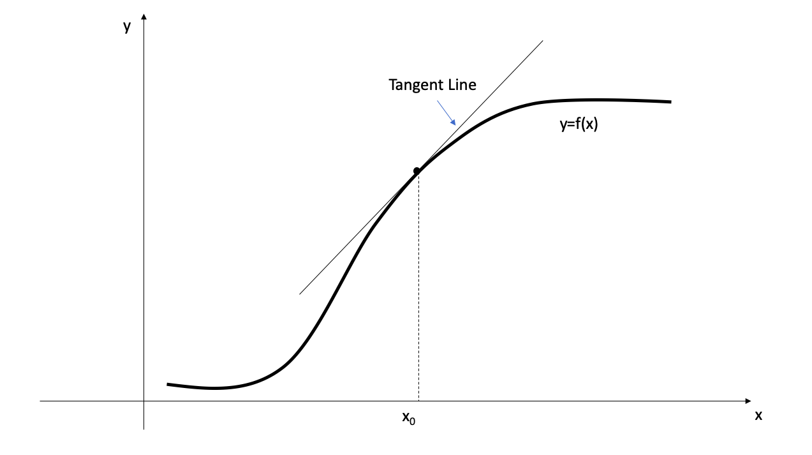
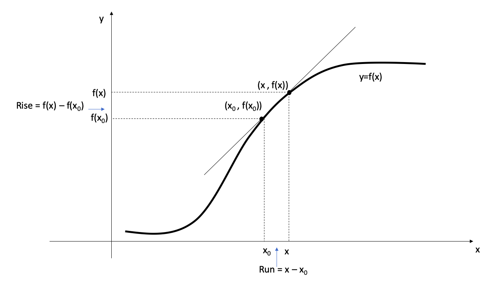
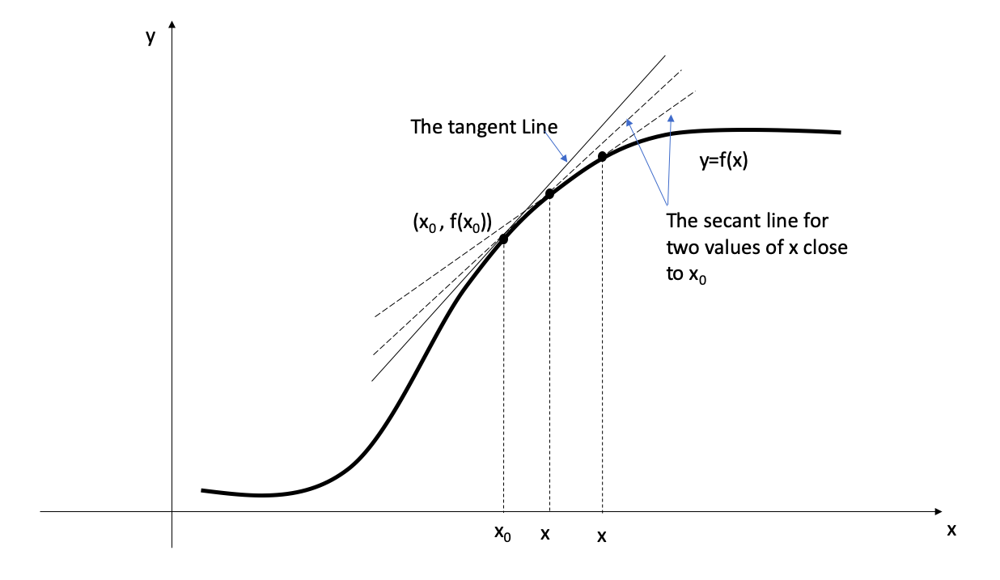
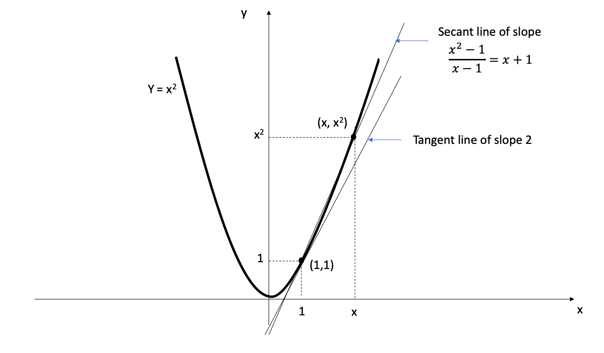
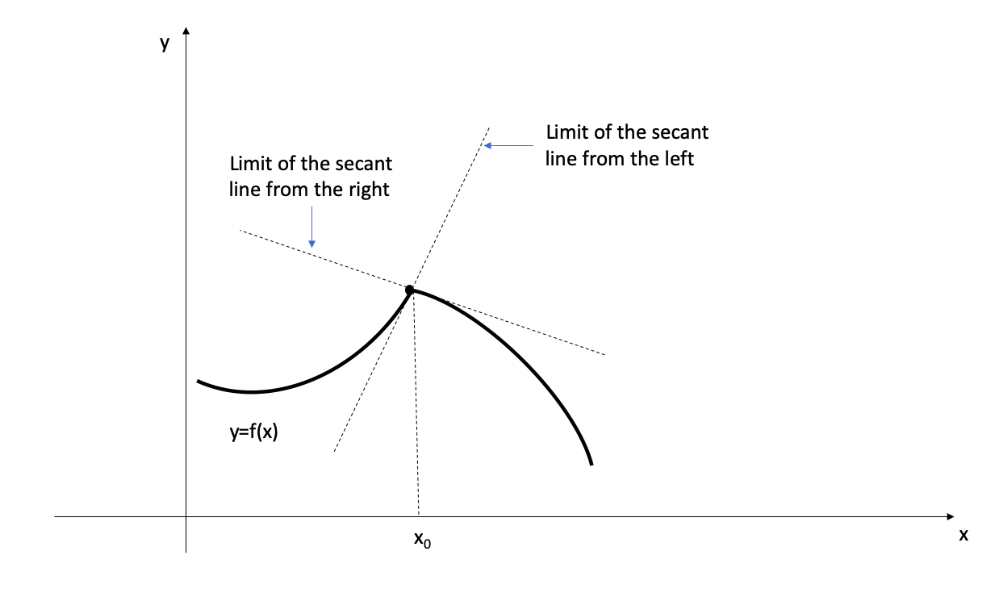
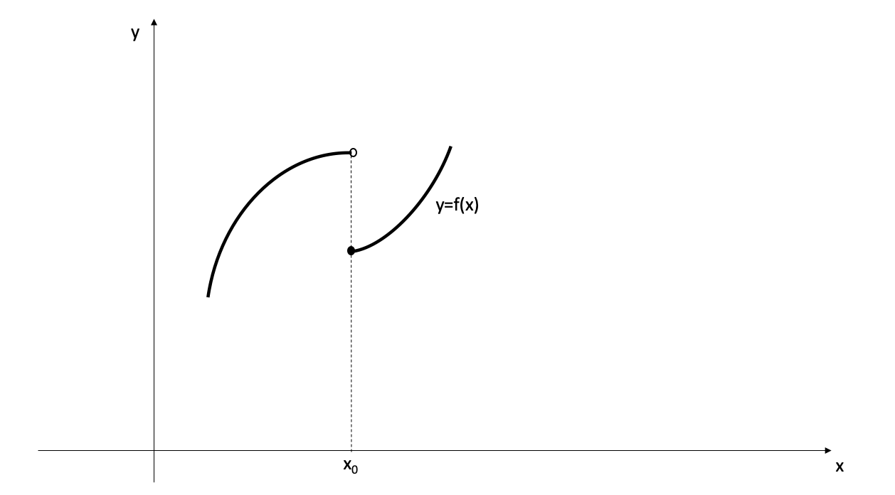
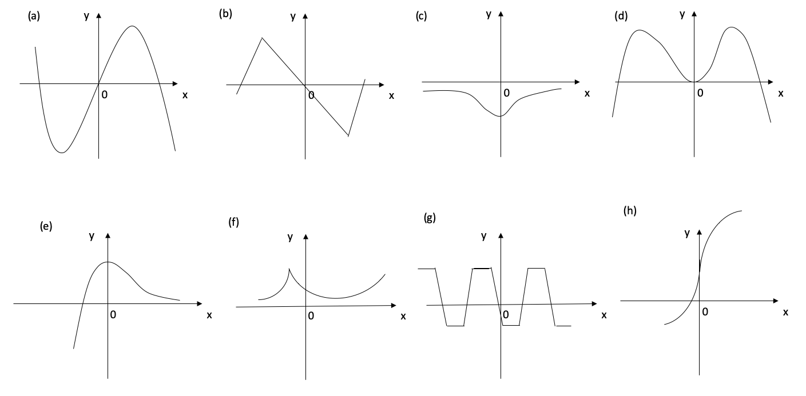
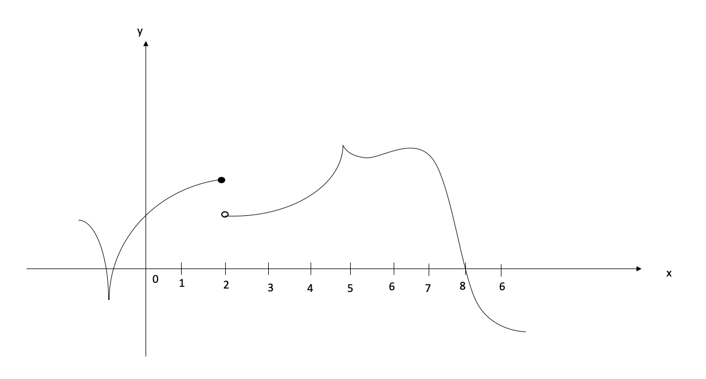
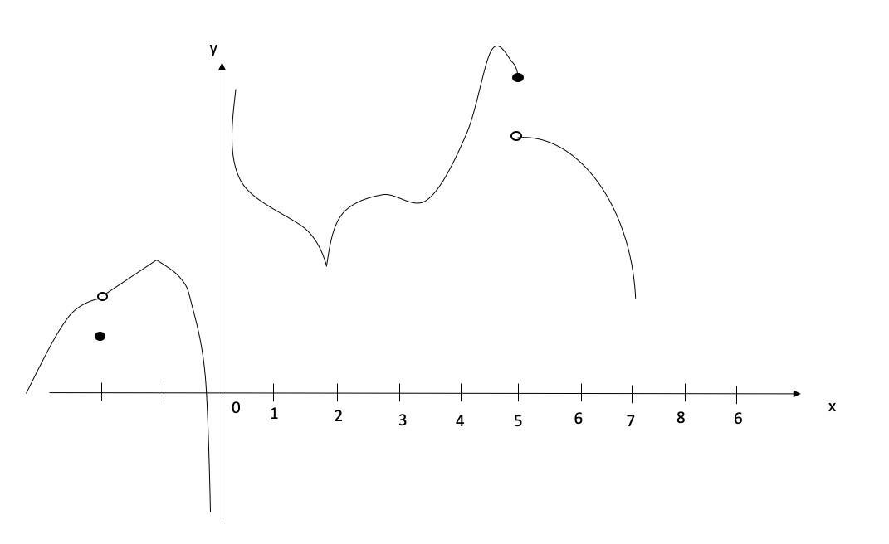

# Differentiation and Integration

<!--  Differentiation (hard copy available): Shenk, A. (1988). Calculus and analytic geometry. Scott Foresman & Company.-->

<!--Stewart, J. (2003). Calculus: Early Transcendentals. Thomson Learning. Inc., Belmont, CA.-->

<!-- Factorization https://en.wikipedia.org/wiki/Factorization-->

```{r initial5, echo = FALSE, cache = FALSE, include = FALSE}
library(knitr)
opts_chunk$set(
  warning = FALSE,
  message = FALSE,
  echo = FALSE,
  fig.path = 'figure/',
  cache.path = 'cache/',
  fig.align = 'center',
  fig.show = 'hold',
  cache = FALSE,
  external = TRUE,
  dev = "png",
  fig.height = 16,
  fig.width = 10,
  out.width = "0.8\\textwidth"
)


library(tidyverse)

```

\pagenumbering{arabic}

## Differentiation 

**Reading :**

Stewart, J. (2003). Calculus: Early Transcendentals. Thomson Learning. Inc., Belmont, CA.

Shenk, A. (1988). Calculus and analytic geometry. Scott Foresman & Company.


### Derivative and tangent lines

#### Geometric meaning of the derivative

- The steepness of a line can be determined by its *slope*.
- The steepness of the graph of a function ($f$) at a given point on it (say $(x_0, f{(x_0)})$), can be approximate by its **tangent Line** at that point. 
- The slope of the tangent line at a point on the function is equal to the derivative of the function at that point 
- *The derivative of $f$ at $x_0$*  is denoted by $f^\prime (x_0)$  

```{r   out.width = "70%", echo = FALSE, fig.align='center'}

```


- The direct computation of the slope of the tangent line is not possible as we are given only one point $(x_0, f{(x_0)})$.
- Instead,  we consider the **secant line** through two points: $(x_0, f{(x_0)})$ and $(x, f{(x)})$, on the graph of $f$.

```{r   out.width = "70%", echo = FALSE, fig.align='center'}

```

- As $x$ approaches $x_0$, the secant line is approaching to the tangent line. 
- As $x$ varies, the secant line turns about the fixed point  $(x_0, f{(x_0)})$. 
- We can describe the tangent line as the limiting line of the secant line when $x$ approaches $x_0$ from either direction. 

```{r   out.width = "70%", echo = FALSE, fig.align='center'}

```

- As we move on the secant line from $(x_0, f{(x_0)})$ to $(x, f{(x)})$
   - the rise is $f(x) - f(x_0)$
   - the run is $x - x_0$.
- Therefore, 
$$\text{The slope of the secant line} = \frac{f(x) - f(x_0)}{x - x_0} \text{ for } x\neq x_0.$$
- To have the derivative be the slope of the tangent line, we define it as the limit of the slope of the secant line.

**Definition: Tangent line **

**The tangent line to the curve $y=f(x)$ at the point $P(x_0, f(x_0))$ is the line through $P$ with slope** $$m = lim_{x\to x_{0}}\frac{f(x)-f(x_0)}{x-x_0}$$

**provided that this limit exists**


**Definition**

**The derivative of a function $f$  at $x_0$ is**
$$f^{\prime}(x_0) = lim_{x\to x_{0}}\frac{f(x) - f(x_0)}{x-x_0}$$
**provided this limit exists and is finite.**


- If this limit does not exist or if it is infinite, we say that **$f$ does not have a derivative at $x_{0}$**

*Example 1*

Compute the derivative of the function $x^2$ at $x=1$.

```{r Devbox1a, out.width='100%', fig.asp=.9, fig.align='center', fig.pos='h'}
library(ggplot2)

ggplot()+
  theme_void()+
  theme(panel.border = element_rect(colour = "white", fill=NA, size=1))

```

\newpage

**The geometric interpretation of the above solution**

```{r   out.width = "100%", echo = FALSE, fig.align='center'}

```

- The derivative is the slope of the tangent line to the graph at the point $(1,1)$. ( $f^\prime(1) = 2$)
- The secant line has slope $x+1$, and the limit of that slope as x tends to 1 is the slope 2 of the tangent line


#### Equations of the tangent lines


- When we compute the derivative, $f^\prime(x_0)$, we can give an equation for the tangent line at $(x_0, f(x_0))$ on the graph of $f$.
- the tangent line has the equation $$y-f(x_0)= f^\prime(x_0)(x-x_0)$$


\newpage

*Example 2*

Give the equation for the tangent line to the parabola $y=x^2$ at $x=1$.

```{r Devbox2, out.width='100%', fig.asp=.5, fig.align='center', fig.pos='h'}
library(ggplot2)

ggplot()+
  theme_void()+
  theme(panel.border = element_rect(colour = "white", fill=NA, size=1))

```


#### Important properties

**1. Differentiable functions are continuous**

- A function must be continuous at any point where it has a derivative.

\newpage

**Theorem**

**If the derivative $f^\prime(x_0)$ exists, then the function $f$ is continuous at $x_{0}$.**

<!--The converse of Theorem 4 is false-->

```{r Devbox3, out.width='100%', fig.asp=.95, fig.align='center', fig.pos='h'}
library(ggplot2)

ggplot()+
  theme_void()+
  theme(panel.border = element_rect(colour = "white", fill=NA, size=1))

```

**2. Continuous functions that do not have derivative**

-  The converse of the above theorem is false; that is, there are  functions that are continuous but not differentiable. 

- This usually occurs in one of the three ways:

1. When the graph of $f$ has a vertical tangent line at a given point. ($\frac{f(x) - f(x_0)}{x-x_0}$ tends to $\infty$ or to $-\infty$ as $x$ tends to $x_0$)


```{r   out.width = "100%", echo = FALSE, fig.align='center'}
knitr::include_graphics("figure/5Derivatives-6.png")
```

2. When the secant line has different limits as $x$ tends to $x_0$ from the left and from the right (i.e. when the graph has a sharp corner or a cusp at $x=x_0$).


```{r   out.width = "100%", echo = FALSE, fig.align='top'}

```

3. When there is a jump discontinuity. The graph of a function will not have a tangent line at a point where the function is discontinuous.

```{r   out.width = "100%", echo = FALSE, fig.align='center'}

```

- This graph does not have a tangent line at $x=x_{0}$
- Therefore, the function $f$ does not have a derivative at $x_{0}$.


\newpage

### Leibniz notation  and derivative as a function


### The derivative of $x^n$, derivatives of linear combinations

### The product and quotient rules

### Average velocity and velocity

### Other rate of change

### Composite functions and the chain rule

### The derivatives of sine and cosine


## Integration


### The geometric definition of the integral

### The Fundamental Theorem of Calculus

### Indefinite integrals and integrals of $x^n$ ($n\neq-1$, $sin x$, $cos x$)

### The algebra of integrals

### integration and substitution

### the analytic definition of the integral


**Reading :**

Stewart, J., Clegg, D. K., & Watson, S. (2020). Calculus: early transcendentals. Cengage Learning.

Shenk, A. (1988). Calculus and analytic geometry. Scott Foresman & Company.


\newpage

\pagenumbering{arabic}

## Tutorial 

### Chapter 5.1: Differentiation {-}

1. The graph of function $f$  is given. Use it to sketch the graph of the derivative $f^\prime$

```{r   out.width = "100%", echo = FALSE, fig.align='center'}

```

2. Find the derivative of the function using the definition of derivative. state the domain of the function and the domain of the derivative.

(a) $f(x) = 20$
(b) $f(x) = 1-3x^2$
(c) $f(x) = x^3 -3x+5$
(d) $f(x) = \sqrt{1+2x}$
(e) $f(x) = 12+5x$
(f) $g(x) = 5x^2+3x-2$
(g) $g(x) = x+\sqrt{x}$
(h) $g(x) = \frac{3+x}{1-3x}$
(i) $G(t) = \frac{4t}{t+1}$
(j) $g(x) = \frac{1}{x^2}$
(k) $G(t) = t^4$

3. The graph of $f$ is given.

(i) At what values is $f$ discontinuous? Why?
(ii) At what values is $f$ not differentiable? Why?


```{r   out.width = "70%", echo = FALSE, fig.align='center', fig.cap="(a)"}

```

```{r   out.width = "70%", echo = FALSE, fig.align='center', fig.cap="(b)"}

```