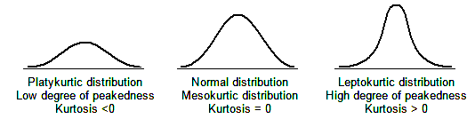

# Descriptive Statistics 

```{r initial, echo = FALSE, cache = FALSE, include = FALSE}
library(knitr)
opts_chunk$set(
  warning = FALSE,
  message = FALSE,
  echo = FALSE,
  fig.path = 'figure/',
  cache.path = 'cache/',
  fig.align = 'center',
  fig.show = 'hold',
  cache = TRUE,
  external = TRUE,
  dev = "png",
  fig.height = 16,
  fig.width = 10,
  out.width = "0.8\\textwidth"
)


library(tidyverse)
library(janitor)

```

\pagenumbering{arabic}

## 	Introduction to Statistics

###	Some Basic Terminologies Used in Statistics

**i	Population**

-	The set of **all** possible elements in the universe of interest to the researcher

**ii	Sample**

-	A Sample is a **subset** (a portion or part) of the population of interest
-	The sample must be a representative of the population of interest

**iii	Element**

-	Element is an **entity or object** which the information is collected.
-	*Eg: Student, household, farm, company, tomato plant*

**iv	Variable**

-	A variable is **a feature characteristic which has different ‘values’ or categories for different elements** (items/subjects/individuals)
-	*Eg: Gender of client, brand of mobile phones, risk level, number of emails received per day, age of client, income of client*

**v	Data**

-	Data are **measurements or facts** that are collected from a statistical unit/entity of interest
-	We collect data on variables
-	Data are raw numbers or facts that must be processed (analysed) to get useful information.
-	We get information from data.

-	*Eg:* 

  ***Variable:*** *Age (in years) of client*

  ***Data:*** *21, 45, 18, 32, 30, 22, 23, 27* 
    
  ***Information:***  

  *The mean age is 27.25 years*

  *The minimum age is 18 years*

  *The range of ages is 18-45*

  *The percentage of clients below 25 years of age: 50%*

**vi	Statistic**

-	**Characteristic** of a **sample**
-	The value which calculated based on sample data

**vii	Parameter**

-	**Characteristic** of a **population**
-	The value which calculated based on population data

**viii Census**

-	When a researcher **gathers data from the whole population for a given measurement,** it is called a census

**ix	Sampling**

-	When a researcher **gathers data from a sample of the population for a given measurement,** it is called sampling
-	The process of selecting a sample is also called sampling 


**Why take a sample instead of studying every member of the population ?**

-	Prohibitive cost of census
-	Destruction of item being studied may be required
-	Not possible to test or inspect all members of a population being studied.


###	Branches of Statistics 


```{r box1, fig.cap='', out.width='100%', fig.asp=.75, fig.align='center'}
library(ggplot2)

ggplot()+
  theme_void()+
  theme(panel.border = element_rect(colour = "black", fill=NA, size=1))

```

**i	Descriptive Statistics**

-	Descriptive statistics consists of organizing, summarizing and presenting data in an informative way.
-	The main purpose of descriptive statistics is to provide an overview of the data collected. 
-	Descriptive statistics describes the data collected through frequency tables, graphs and summary measures (mean, variance, quartiles, etc.).

**ii	Inferential Statistics**

-	In inferential statistics sample data are used to draw inferences (i.e. derive conclusions) or make predictions about the populations from which the sample has been taken.
-	This includes methods used to make decisions, estimates, predictions or generalizations about a population based on a sample. 
-	This includes point estimations, interval estimation, test of hypotheses, regression analysis, time series analysis, multivariate analysis, etc. 


### Types of Variables

```{r box2, fig.cap='', out.width='100%', fig.asp=.75, fig.align='center'}
#df<-data.frame(x = NULL, y = NULL)

ggplot()+
  theme_void()+
  theme(panel.border = element_rect(colour = "black", fill=NA, size=1))

```


####	Qualitative / Quantitative Variables

**i Qualitative variable (Categorical variable)**

-	The characteristic is a quality.
-	The data are categories.
-	They cannot be given numerical values. 
-	However, it may be given a numerical label
-	Qualitative variables are sometimes referred as categorical variables.
-	*Eg:*

  *Gender:* 
  
  *Age group:*
  
  *Education level:* 
  
  *A/L stream:* 
  
  *Degree type:*

  *Hair colour: *  
   
  *FIT student batch:* 
  
  *Undergraduate level:*
  
  *Grade that you can obtain for CM 1110/ CM1130* 

**ii Quantitative variable **

-	The characteristic is a quantity
-	The data are numbers
-	Quantitative data require numeric values that indicate how much or how many.
-	They are obtained by counting or measuring with some scale
-	*Eg: *

  *Number of family members:* 
  
  *Number of emails received per day:* 
  
  *Weight of a student:*
  
  *Age:* 
  
  *Credit balance in the SIM card:*
  
  *Time remaining in class:*
  
  *Temperature:*
  
  *Marks *

####	Discrete/ Continuous Variables

-	Quantitative variables can be classified as either discrete or continuous.

**i Discrete Variables**

-	Quantitative
-	Usually the data are obtained by counting
-	There are impossible values between any two possible values 
-	*Eg:* 

   *Number of family members:*

   *Number of emails received per day:*

**ii Continuous Variables**

-	Quantitative
-	Usually, the data are obtained by measuring with a scale
-	There are no impossible values between any two possible values.(any value between any two possible values is also a possible value)
-	i.e a continuous variable can take any value within a specified range.
-	*Eg:*

   *Weight of a student:* 

   *Age:* 

   *Credit balance in the SIM card:* 
 
   *Time remaining in class:*

   *Temperature:*

   *Marks* 

###	Scales of Measurements


```{r box3, fig.cap='', out.width='100%', fig.asp=.75, fig.align='center'}
#df<-data.frame(x = NULL, y = NULL)

ggplot()+
  theme_void()+
  theme(panel.border = element_rect(colour = "black", fill=NA, size=1))

```

-	There are four levels of measurements called, **nominal, ordinal, interval and ratio.**
-	Each levels has its own rules and restrictions
-	Different levels of measurement contains different amount of information with respect to whatever the data are measuring


**i	Nominal Scale**

-	Qualitative
-	No order or ranking in categories.
-	These categories have to be mutually exclusive, i.e. it should not be possible to place an individual or object in more than one category
-	A name of a category can be substituted by a number, but it will be mere label and have no numerical meaning


**ii	Ordinal Scale**

-	Qualitative
-	Categories can be ordered or ranked
-	A name of a category can be substituted by a number, but such a sequence does not indicate absolute quantities.
-	Difference between any two numbers on the scale does not have a numerical meaningful.
-	It cannot be assumed that the differences between adjacent numbers on the scale are equal.


**iii	Interval Scale**

-	Quantitative
-	Data can be ordered or ranked
-	There is no absolute zero point. Zero is only an arbitrary point with which other values can compare
-	Difference between two numbers is a meaningful numerical value
-	Ration of two numbers is not a meaningful numerical value.


**iv	Ratio Scale**

-	Quantitative
-	Highest level of measurement
-	There exist an absolute zero point  (It has a true zero point)
-	Ratio between different measurements is meaningful


\newpage

## Presentation of Data

The sinking of the Titanic is one of the most infamous shipwrecks in history.

On April 15, 1912, during her maiden voyage, the widely considered “unsinkable” RMS Titanic sank after colliding with an iceberg. Unfortunately, there weren’t enough lifeboats for everyone onboard, resulting in the death of 1502 out of 2224 passengers and crew 

^[Data source: https://www.kaggle.com/varimp/a-mostly-tidyverse-tour-of-the-titanic]

Here’s a quick summary of our variables:

Variable Name | Description
--------------|-------------
PassengerID   | Passenger ID (just a row number, so obviously not useful for prediction) 
Survived      | Survived (1) or died (0)
Pclass        | Passenger class (first, second or third)
Name          | Passenger name
Gender        | Passenger Gender
Age           | Passenger age
SibSp         | Number of siblings/spouses aboard
Parch         | Number of parents/children aboard
Ticket        | Ticket number
Fare          | Fare
Cabin         | Cabin
Embarked      | Port of embarkation (S = Southampton, C = Cherbourg, Q = Queenstown)

### Tabular Presentations of Data 

**Raw Data**

-	Raw data are collected data that have not been organized numerically
-	Eg: Passenger age


<!-- dataset is from : https://www.kaggle.com/varimp/a-mostly-tidyverse-tour-of-the-titanic --> 
```{r}
loc <- here::here("data", "titanic.csv" )
titanic <- read.csv(loc)

```

```{r}
print(head(titanic))
```


```{r}
print(titanic$Age[1:40])
```

```{r eval = FALSE}

data <- c(65,	50,	30,	100,	35,	65,	55,	75,	30,	65,45,	85,	40,	100,
          45,	55,	55,	60,	65,	70,65,	90,	25,	75,	70,	90,	75,	40,	60,	55,
          75,	70,	40,	50,	55,	60,	50,	70,	95,	85)

```

```{r eval = FALSE}
print(data)
```

**An array**

-	An array is an arrangement of raw numerical data in ascending or descending order of magnitude.
-	Eg: Passenger age


```{r}
print(sort(titanic$Age[1:40]))

```

**Frequency Table (Frequency Distributions)**

-	A frequency table (frequency distribution) is  a listing of the values a variable takes in a data set, along with how often (frequently) each value occurs
-	frequency can be recorded as a
     - **frequency or count:** the number of times a value occurs, or
     - **percentage frequency:** the percentage of times a value occurs
-	Percentage frequency can be calculated as,
 
$$Percentage frequency = \frac{a}{b} \times100 \%$$

-	The objective of constructing a frequency table are as follows
    - to organize the data in a meaningful manner
    - to determine the nature or shape of the distribution
    -	to draw charts and graphs for the presentation of data
    - to facilitate computational procedures for measures of average and spread
    -	to make comparisons between different data sets
    
- There are two basic types of frequency tables
    1. Simple frequency tables (Ungrouped frequency distribution)
    2. Grouped frequency distribution


#### Simple frequency table (Ungrouped frequency distribution)


-	Each possible value or category is taken as a class
-	More suitable for 
     - Qualitative variables
     - Discrete variables
-	Sometimes construct for continuous variables when there is a small number of possible values between the minimum and maximum.


Examples:

**CASE I:**

Example 1

The native countries of 56 students from a certain education institute are as follows:

```{r}
data1 <- c("SL",	"BD",	"SL",	"SL",	"SL",	"SL",	"IN",	"SL",	"SL",	"SL",	"BD",	"SL",	"SL", "SL",	"IN",	"SL",	"SL",	"BD",	"SL",	"SL",	"SL",	"SL",	"SL",	"SL",	"SL",	"SL", "SL",	"MD",	"SL",	"SL",	"SL",	"SL",	"SL",	"SL",	"PK",	"MD",	"PK",	"SL",	"SL", "SL",	"SL",	"SL",	"PK",	"MD",	"SL",	"SL",	"SL",	"SL",	"SL",	"SL",	"SL",	"SL","SL",	"SL",	"MD",	"MD")

print(data1)

```
BD- Bangladesh, IN-India, MD-Maldives, PK-Pakistan, SL- Sri Lanka

Construct a frequency table

```{r }
data1 %>% as.tibble() %>%
   mutate( value = recode(value, BD = "Bangladesh", IN = "India", MD= "Maldives", PK = "Pakistan", SL= "Sri Lanka")) %>%
  count(value)  %>%
  mutate(Percentage =     
         round(prop.table(n),5)*100) %>%
  janitor::adorn_totals("row") %>%
  setNames(c("Native Country", "Count", "Percentage (%)")) 
#%>%
#  kable(caption = "The frequency distribution of native countries")
```


**CASE II:**

Example 2

The grades of 30 students for Statistics are as follows:


```{r}
data2 <- c("B",	"C",	"B",	"D",	"B"	,"C",	"C",	"A",	"B"	,"C","C",	"B",	"E"	,"B",	"B",	"D"	,"D",	"F"	,"B",	"D","D"	,"A",	"B"	,"A",	"B",	"C"	,"E",	"A",	"A")

print(data2)

```


Construct a frequency table

```{r}
data2 %>% as.tibble()  %>%
  count(value)  %>%
  mutate(Percentage =     
         round(prop.table(n),5)*100) %>%
  adorn_totals("row") %>%
  setNames(c("Grade", "Count", "Percentage (%)"))

#%>%
#kable(caption = "The frequency distribution of grades for Statistics")
```

**CASE III:**

Example 3

The number of family members of a sample of undergraduates of Batch 19 are as follows:

```{r}
data3 <- c(7,	5,	3,	4	,5,	4	,3,	6	,4,	4,5,	2,	7,	4,	5,	6,	4,	4,	3	,5)

print(data3)
```

Construct a frequency table

```{r}
data3 %>% as.tibble()  %>%
  count(value)  %>%
  mutate(Percentage =     
         round(prop.table(n),5)*100) %>%
  adorn_totals("row") %>%
  setNames(c("Number of family members", "Count", "Percentage (%)"))
#%>%
#kable(caption = "The frequency distribution of the number of family members")

```

**CASE IV:**

Example 4

The ages (in years) of a sample of undergraduates of Batch 19 are as follows:

```{r}
data4 <- c(21 ,	22,	22,	23	,22	,24	,24,	23,	21,	22,23,	22,	22,	23,	21,	21,	22,	23,	22,	23)

print(data4)

```
Construct a frequency table

```{r}
data4 %>% as.tibble()  %>%
  count(value)  %>%
  mutate(Percentage =     
         round(prop.table(n),5)*100) %>%
  adorn_totals("row") %>%
  setNames(c("Age (years)", "Count", "Percentage (%)"))
#%>%
#kable(caption = "The frequency distribution of ages of undergraduates of Batch 19")

```


####	Grouped frequency distribution

-	A grouped frequency distribution (table) is obtained by constructing classes (or intervals) for the data and then listing the corresponding number of values in each interval. 
-	Suitable for quantitative variables with large number of possible values in the range of data.
-	Note that when items have been grouped in this way, their individual values are lost.
-	When studying about frequency distributions it is very important to know the meaning of the following terms

**i	Class intervals**

-	In a frequency distribution the total range of the observations are divided into a number of classes. Those are called *class intervals*
-	Eg: Class intervals: 10-14, 15-19, 20-24, …, 40-44

**ii	Class limits**

-	Class limits are the smallest and largest piece of data value that can fall into a given class. 
-	In the class interval 10-14, the end numbers, 10 and 14, are called class limits
-	The smaller number (10) is the *lower class limit*
-	The larger  number (14) is the *upper class limit*


**iii	Class boundaries**

-	Class boundaries are obtained by adding the upper limit of one class interval to the lower limit of the next-higher class interval and dividing by 2.
-	Class boundaries are also called **True class limits**
-	Class boundaries **should not** *coincide with actual observations*


Class interval |	Class boundaries
---------------|--------------------
10 - 14	 | 9.5 – 14.5
15 - 19	| 14.5 – 19.5
20 - 24	| 19.5 – 24.5
25 - 29	| 24.5 – 29.5 
30 - 34	| 29.5 – 34.5
35 - 39	| 34.5 – 39.5
40 - 44	| 39.5 – 44.5


**iv	The size or width of a class interval**

-	The size or width of a class interval is the difference between the *lower and upper class boundaries*
-	It is also referred to as  the *class width, class size, or class length*
-	Eg: The class width for the class 10-14 is = 14.5-9.5 = 5

**v	The class mark ( Midpoint of the class)**

-	Midpoint of the class 
-	Also called as *class midpoint*
- $\text{Midpoint of the class} = \frac{\text{Lower limit} + \text{Upper limit}}{2}$

or

- $\text{Midpoint of the class} = \frac{\text{Lower boundary} + \text{Upper boundary}}{2}$


**vi	Open class intervals**

-	A class interval that, at least theoretically, has either no upper class limit or no lower class limit indicated is called an *open class interval*

-	For example, referring to age groups of individuals, the class interval "65 year and over" is an open class interval


**Rules and Practices for constructing grouped frequency tables**

-	Every data value should be in an interval
-	The intervals should be mutually exclusive 
-	The classes of the distribution must be arrayed in size order.
-	The number of classes not less than 5 or not greater than 15 is recommended. 
-	The following formula is often used to determine the  number of classes:
If n is the number of observations, then 

 
 $$\text{Number of classes} = \sqrt{n}$$
 
  $$\text{Width of the class interval} = \frac{Range}{\sqrt{n}}= \frac{Min-Max}{\sqrt{n}}$$

-	Data should be represented within classes having limits which the data can attain 
-	Classes should be continuous
-	By convention, the beginning of the interval is given the appropriate exact value, rather than the end.  
Eg: intervals of 0-49, 50-99,100-149 would be preferred over the intervals 1-50, 51-100, 101-150 etc. 
-	The number f observations falling into each category or class interval (class frequency) can be easily found using *tally marks*.


Examples:

In a grouped frequency distribution, class intervals can be constructed in different ways

Example 1

Class interval |	Number of students
---------------|----------------------
10 - 14	|4
15 - 19|	5
20 - 24	|11
25  - 29	|9
30 - 34	|6
35 - 39	|3
40 - 44	|2


Example 2

Salary |	Number of employees
-------|----------------------
0 – 1999 |	1
2000 – 3999	|31
4000 – 5999	|18
6000 – 7999	|4
8000 – 9999	|2
10000 - 11999	|1
12000 – 13999	|0
14000 – 15999|	0
16000 – 17999	|1
18000 -19999	|1
20000-21999	|1


Salary	| Number of employees
--------|---------------------
0 – 1999 |	1
2000 – 3999|	31
4000 – 5999	|18
6000 – 7999	|4
8000 – 9999	|2
10000 - 15999	|1
16000 – 21999	|3
Total|	60


**Example 3**


Salary |	Number of employees
-------|----------------------
Less than 2000	|1
2000 – 2999	|11
3000 – 3999|	20
4000 – 5999|	18
6000 – 9999|	6
Greater than or equal to 10000|	4
Total|	60

####	Two-way frequency table

-	Cross tabulation, Cross classification table, Contingency table, Two-way table
-	Display the relationship between two or more qualitative variables (categorical variables (nominal or ordinal)) 


```{r}

titanic %>%
     mutate( Pclass = recode(Pclass, "1" = "First", "2" = "Second", "3"= "Third")) %>%
       mutate( Survived = recode(Survived, "1" = "Survived", "0" = "died")) %>%
count(Pclass,Survived) %>%
  group_by(Pclass) %>%
 # mutate(prop = n / sum(n)) %>%
  #select(-n) %>%
  spread(Pclass, n, fill = 0)


```


```{r}

titanic %>%
     mutate( Pclass = recode(Pclass, "1" = "First", "2" = "Second", "3"= "Third")) %>%
       mutate( Survived = recode(Survived, "1" = "Survived", "0" = "died")) %>%
count(Pclass,Survived) %>%
  group_by(Pclass) %>%
  mutate(prop = round(n / sum(n),2)) %>%
  select(-n) %>%
  spread(Pclass, prop, fill = 0)


```


### Graphic Presentations of Data

-	A diagram is a visual form for presentation of statistical data.
-	The form of the diagram varies according to the nature of the data

#### Describing Qualitative Data


-	Bar chart / Pie chart
-	Suitable for 
     - Qualitative variables (nominal or ordinal)
     - Discrete variables (when the number of bars or number of different values is small)


**I	Bar Chart**

-	A bar graph uses bars to represent discrete categories of data
-	It can be drawn either on horizontal (more common) or vertical base
-	A rectangle of equal width is drawn for each category
-	The height (in vertical bar chart) or the length (in horizontal bar chart) of the rectangle is equal to the category’s **frequency** or **percentage**.

```{r box6, out.width='100%', fig.asp=.75, fig.align='center', fig.pos='h'}
#df<-data.frame(x = NULL, y = NULL)

ggplot()+
  theme_void()+
  theme(panel.border = element_rect(colour = "black", fill=NA, size=1))

```


**i	Simple Bar Chart**

-	Only one categorical variable can be presented
-	Often used in conjunction with simple frequency tables
-	The bars do not touch each other
-	The gaps between adjacent bars are same in length


```{r}

s_table1<-titanic %>%
     mutate( Pclass = recode(Pclass, "1" = "First", "2" = "Second", "3"= "Third"))  %>%
count(Pclass) %>%
  mutate(Percentage =     
         round(prop.table(n),5)*100) %>%
 # adorn_totals("row") %>%
  setNames(c("Passenger class", "Count", "Percentage"))
```

```{r box8, out.width='80%', fig.asp=.75, fig.align='center' }

kable(s_table1)
ggplot(data=s_table1, aes(x=`Passenger class`, y=Count)) +
  geom_bar(stat="identity") +
  geom_text(data=s_table1, aes(label=Count), vjust=-0.3, size=4.5)+
  ggtitle("Composition of passengers by passenger class")+
  scale_fill_grey()+
  theme(axis.text=element_text(size=16),
        axis.title=element_text(size=16))

```


```{r box9, out.width='80%', fig.asp=.75, fig.align='center' }

ggplot(data=s_table1, aes(x=`Passenger class`, y=Percentage)) +
  geom_bar(stat="identity") +
  geom_text(data=s_table1, aes(label=paste(Percentage, "%")), vjust=-0.3, size=4.5) +
  ggtitle("Composition of passengers by passenger class " )+
  scale_fill_grey()+
    theme(axis.text=element_text(size=16),
        axis.title=element_text(size=16))
```


**ii	Component Bar Chart **

-	**Sub divided bar chart/ Stacked bar chart**
-	Use to compare two or more qualitative variables (nominal or ordinal) 
-	Often used in conjunction with two way tables
-	Start by drawing a simple bar chart with the total figures. 
-	The bars are then divided into the component parts
-	Can be drawn on absolute figures or percentages
-	The various components should be kept in the same order in each bar
-	To distinguish different components from one another, different colours or shades can be used

```{r}

datas<-titanic %>%
     mutate( Pclass = recode(Pclass, "1" = "First", "2" = "Second", "3"= "Third")) %>%
       mutate( Survived = recode(Survived, "1" = "Survived", "0" = "died")) %>%
count(Pclass,Survived) %>%
  group_by(Pclass) 
  

  
 # mutate(prop = n / sum(n)) %>%
  #select(-n) %>%
kable( datas%>% spread(Pclass, n, fill = 0) )
```


```{r box10, out.width='80%', fig.asp=.75, fig.align='center'}
# Stacked barplot with multiple groups
ggplot(data=datas, aes(x=Pclass, y=n, fill=Survived)) +
  geom_bar(stat="identity")+
  ggtitle("Composition of the passengers by passenger class and survival condition") +
  scale_fill_grey()+
    theme(axis.text=element_text(size=16),
        axis.title=element_text(size=16))+
  xlab("Passenger Class")+
  ylab("Count")
```


**Percentage component bar chart**

-	When sub-divided bar chart is drawn on percentage basis it is called percentage bar chart
-	The various components are expressed as percentage to the total 
-	All bars are equal in height


```{r box11, out.width='80%', fig.asp=.75, fig.align='center'}


datas<-titanic %>%
     mutate( Pclass = recode(Pclass, "1" = "First", "2" = "Second", "3"= "Third")) %>%
       mutate( Survived = recode(Survived, "1" = "Survived", "0" = "died")) %>%
count(Pclass,Survived) %>%
  group_by(Pclass) %>%
 mutate(prop = n / sum(n)) %>%
  select(-n) 


  #select(-n) %>%
kable( datas%>% spread(Pclass, prop, fill = 0))


ggplot(data=datas, aes(x=Pclass, y=prop, fill=Survived)) +
  geom_bar(stat="identity")+
  ggtitle("Composition of the passengers by passenger class and survival condition") +
  scale_fill_grey()+
    theme(axis.text=element_text(size=16),
        axis.title=element_text(size=16))+
  xlab("Passenger Class")+
  ylab("Percentage")


```


**iii	Multiple Bar Chart**

-	Compound bar chart/ Cluster bar chart
-	Use to compare two or more qualitative variables (nominal or ordinal) 
-	Often used in conjunction with two way tables
-	These bar charts are drawn side by side 


```{r box12, out.width='80%', fig.asp=.75, fig.align='center'}


datas<-titanic %>%
     mutate( Pclass = recode(Pclass, "1" = "First", "2" = "Second", "3"= "Third")) %>%
       mutate( Survived = recode(Survived, "1" = "Survived", "0" = "died")) %>%
count(Pclass,Survived) %>%
  group_by(Pclass) %>%
 mutate(prop = round(n / sum(n),4)*100) %>%
  select(-n) 


  #select(-n) %>%
kable(datas%>% spread(Pclass, prop, fill = 0))


ggplot(data=datas, aes(x=Pclass, y=prop, fill=Survived)) +
  geom_bar(stat="identity", position=position_dodge())+
  ggtitle("Composition of the passengers by passenger class and survival condition")+
  geom_text(aes(label=prop), vjust=1.6, color="black",
            position = position_dodge(0.9), size=4.5)+
    scale_fill_grey()+
    theme(axis.text=element_text(size=16),
        axis.title=element_text(size=16))+
  xlab("Passenger Class")+
  ylab("Percentage")


```


#### Describing Quantitative Data

-	Histogram/  Dot plot / Box plot/ Scatter plot


**II	Histogram**

-	Histogram looks similar to bar chart since it also has bars. 
-	However, it is different from a bar chart in a number of aspects. 
-	One main difference is that in the histogram, the bars are drawn attached to each other; there are no gaps between bars like in a bar chart.
-	Histogram is used to show the shape of the distribution of a **continuous variable**. 
-	However, the histogram is also used for discrete variables when the data are grouped in to class intervals. 
-	In a histogram, **the area of a bar should be proportional to the frequency of the corresponding class.**
-	If all the bars have the same width, then the height of a bar can represent the frequency. 
-	The bar corresponding to a class interval should be drawn from the lower class boundary to the upper class boundary. In this way there will be no gaps between the bars.


Example:  The marks(out of 50) of a group of students are recorded in the accompanying table. Draw a histogram for the data

Marks |	Number of students
------|------------------
10 - 14	| 4
15 - 19	| 5
20 - 24	| 11
25  - 29 |	9
30 - 34	| 6
35 - 39 |	3
40 - 44	| 2
Total	 | 40


```{r hist, out.width='80%', fig.asp=.75, fig.align='center'}
set.seed(123)
 data <- tibble(Marks = c(11,12,12,13,15,16,17,18,18, round(rnorm(11,22,1),0), round(rnorm(9,27,1),0), round(rnorm(6,32,1),0), 36,37,38,41,44))

 
ggplot(data, aes(Marks)) +
  geom_histogram(binwidth = 5,  boundary = -0.5, pad = TRUE, col = "black", fill = "lightgray") + 
   ggtitle("Histogram of Marks")+
  ylab("Frequency")+
      theme(axis.text=element_text(size=16),
        axis.title=element_text(size=16))
```


Example 2

```{r box18, out.width='80%', fig.asp=.75, fig.align='center'}
#df<-data.frame(x = NULL, y = NULL)

p<-ggplot(titanic, aes(x=Fare))+
  geom_histogram(color="black", fill="white")+
  facet_grid(Pclass ~ .)+
      theme(axis.text=element_text(size=16),
        axis.title=element_text(size=16))
p

```


**III	Frequency polygon**

-	If the mid-point of the top of each block in a histogram is joined by a straight line, a frequency polygon is produced. 
-	This is done under the assumption that the frequencies in a class-interval are evenly distributed throughout the class 


Example:  The marks(out of 50) of a group of students are recorded in the accompanying table. Draw a frequency polygon for the data


Marks |	Number of students
------|------------------
10 - 14	| 4
15 - 19	| 5
20 - 24	| 11
25  - 29 |	9
30 - 34	| 6
35 - 39 |	3
40 - 44	| 2
Total	 | 40

```{r hist2, out.width='80%', fig.asp=.75, fig.align='center'}
set.seed(123)
 data <- tibble(Marks = c(11,12,12,13,15,16,17,18,18, round(rnorm(11,22,1),0), round(rnorm(9,27,1),0), round(rnorm(6,32,1),0), 36,37,38,41,44))

 
ggplot(data, aes(Marks)) +
  geom_histogram(binwidth = 5,  boundary = -0.5, pad = TRUE, col = "black", fill = "lightgray") +
  ylab("Frequency") +
  geom_freqpoly( binwidth = 5,  boundary = -0.5)+
      theme(axis.text=element_text(size=16),
        axis.title=element_text(size=16))
```

**IV	Frequency curve**

-	A frequency curve is drawn by smoothing the frequency polygon.
-	It is smooth in such a way that the sharp turns are avoided

Example:  The marks(out of 50) of a group of students are recorded in the accompanying table. Draw a frequency curve for the data


Marks |	Number of students
------|------------------
10 - 14	| 4
15 - 19	| 5
20 - 24	| 11
25  - 29 |	9
30 - 34	| 6
35 - 39 |	3
40 - 44	| 2
Total	 | 40

```{r hist3, out.width='80%', fig.asp=.75, fig.align='center'}
set.seed(123)
 data <- tibble(Marks = c(11,12,12,13,15,16,17,18,18, round(rnorm(11,22,1),0), round(rnorm(9,27,1),0), round(rnorm(6,32,1),0), 36,37,38,41,44))

 
ggplot(data, aes(Marks)) +
  geom_histogram(binwidth = 5,  boundary = -0.5, pad = TRUE, col = "black", fill = "lightgray") + 
  ylab("Frequency")+
 geom_density(aes(y=6* ..count..), bw = 5)+
      theme(axis.text=element_text(size=16),
        axis.title=element_text(size=16))

```

frequency curves arising in practice take on certain characteristics shapes as shown bellow 

```{r   out.width = "100%", echo = FALSE, fig.align='center'}

```

1.	The **symmetrical** or **bell shaped** frequency curves are characterized by the fact that observations equidistant from the central maximum have the same frequency. An important example is the normal curve. 
2.	In the **moderately asymmetrical** or **skewed** frequency curves the tail of the curve to one side of the central maximum is longer than that to the other. If the longer tail occurs to the right the curve is said to be **skewed to the right** or to have **positive skewness**.While if the reverse is true the curve is said to be **skewed to the left** or to have **negative skewness**.
3.	In a **J shaped** or **reverse J shaped** curve a maximum occurs at one end. 
4.	A **U shaped** frequency curve has maxima at both ends. 
5.	A **bimodal** frequency curve has two maxima. These appear as two distinct peaks (local maxima) in the frequency curve.When the two modes are unequal the larger mode is known as the major mode and the other as the minor mode. 
6.	A **multimodal** frequency curve has more than two maxima. 


**V	Dot Plot**

-	A dot plot is a method of presenting data which gives a rough but rapid visual appreciation of the way in which the data are distributed
-	It consists of a horizontal line marked out with divisions of the scale on which the variable is being measured
-This graph can be used to represent only the numerical data.


```{r dotplot, out.width='80%', fig.asp=.75, fig.align='center'}


 
ggplot(titanic, aes(Age)) +
  geom_dotplot(dotsize = 0.3, method = "histodot") +
      theme(axis.text=element_text(size=16),
        axis.title=element_text(size=16),
        axis.text.y=element_blank())+
  ylab("")+
  ggtitle("Distribution of age of titanic passengers")


```

**VI	Box plot (Box and whisker plot)**

-	Box plot is also a useful method of representing the behavior of a data set or comparing two or more data sets.
- Box plot is constructed by identifying five statistics from the data set as largest value, smallest values, median, Q1 and Q3.


```{r   out.width = "100%", echo = FALSE, fig.align='center'}

```


Example:

Construct a box plot for the following data set (Marks of students)

\[\text{52, 88, 56, 79, 72, 91,  85, 88, 68, 63, 76, 73, 86, 95, 12, 69}\]

Xmin = 12	Xmax = 95	Q1 =64.25	Q2 = Median = 74.5	Q3 = 87.5

```{r box61, out.width='100%', fig.asp=.75, fig.align='center', fig.pos='h'}
#df<-data.frame(x = NULL, y = NULL)

ggplot()+
  theme_void()+
  theme(panel.border = element_rect(colour = "black", fill=NA, size=1))

```

```{r boxplot, out.width='80%', fig.asp=.75, fig.align='center'}
data <- tibble(Marks = c(52, 88, 56, 79, 72, 91,  85, 88, 68, 63, 76, 73, 86, 95, 12, 69) )

ggplot(data, aes(y = Marks))+
  geom_boxplot()+
 scale_y_continuous(limits=c(5, 100), breaks = c(10,20,30,40,50,60,70,80,90,100)) +
        theme(axis.text=element_text(size=16),
        axis.title=element_text(size=16))
```

```{r boxplot2, out.width='80%', fig.asp=.75, fig.align='center'}

titanic %>%mutate(Pclass = factor(Pclass)) %>%
  ggplot(aes(y = Fare, x = Pclass)) +
  geom_boxplot() +
  xlab("Passenger Class") +
  theme(axis.text=element_text(size=16),
        axis.title=element_text(size=16))


```

```{r boxplot3, out.width='80%', fig.asp=.75, fig.align='center'}

titanic %>%mutate(Pclass = factor(Pclass)) %>%
  ggplot(aes(y = Fare, x = Pclass)) +
  geom_boxplot() +
  xlab("Passenger Class") +
  theme(axis.text=element_text(size=16),
        axis.title=element_text(size=16))


```

**VII Violin plot**

- A violin plot is a method of plotting quantitative data.
- It is similar to a box plot, with the addition of a rotated kernel density plot on each side.
- Violin plots are similar to box plots, except that they also show the probability density of the data at different values, usually smoothed by a kernel density estimator.

```{r violin1, out.width='80%', fig.asp=.75, fig.align='center'}

titanic %>%mutate(Survived = factor(Survived)) %>%
  ggplot(aes(y = Age, x = Survived)) +
  geom_violin() +
  xlab("Survived") +
  theme(axis.text=element_text(size=16),
        axis.title=element_text(size=16))


```

```{r violin2, out.width='80%', fig.asp=.75, fig.align='center'}

titanic %>%mutate(Pclass = factor(Pclass)) %>%
  ggplot(aes(y = Fare, x = Pclass)) +
  geom_violin() +
  xlab("Passenger Class") +
  theme(axis.text=element_text(size=16),
        axis.title=element_text(size=16))


```

\newpage 

## Summary Measures

###	Measures of Central Tendency

- **Measure of central tendency** yield information about the center, or middle part, of a group of numbers.

- Eg: Mode, Median,  Arithmetic Mean, Geometric mean, Harmonic Mean, Quadratic Mean, Quartiles, Deciles, and Percentiles


#### Mode

- The Mode is the most frequently occuring value In a set of data 

- Organizing the data into an ordered array (an ordering of the numbers from smallest to largest) helps to locate the mode.

- In the case of a tie for the most frequent occuring value, two modes are listed. Then the data are set to be **bimodal**

- If a set of data is not exactly bimodal but contains two values that are more dominant than others, some researchers take the liberty of referring to the data set as bimodal even without an *exact tie* for the mode.

- Data sets with more than two modes are referred to as **multimodal**.

- The mode is an appropriate measure of central tendency for nominal-level data.

- The mode can be used to determine which category occurs most frequently.

- Advantages and disadvantages of mode


```{r box21, out.width='100%', fig.asp=.75, fig.align='center', fig.pos='h'}
#df<-data.frame(x = NULL, y = NULL)

ggplot()+
  theme_void()+
  theme(panel.border = element_rect(colour = "white", fill=NA, size=1))

```


#### Median 

- The median is the middle value in an ordered array of numbers.

- Median divides the series into equal parts

- The following steps are used to determine the median.

- STEP 1: Arrange the observations in an ordered data array.

- STEP 2: For an **odd number** of terms, find the middle term of the ordered array. It is the median.

- STEP 3: For an **even number** of terms, find the arithmetic mean of the middle two terms. This arithmetic mean is the median.

\[Median = \text{the }(\frac{n+1}{2})\text{th item in the data array} \]

- The level of data measurement must be at least ordinal for a median to be meaningful.

- Advantages and disadvantages of median


```{r box22, out.width='100%', fig.asp=.75, fig.align='center', fig.pos='h'}
#df<-data.frame(x = NULL, y = NULL)

ggplot()+
  theme_void()+
  theme(panel.border = element_rect(colour = "white", fill=NA, size=1))

```


####	Arithmetic Mean 

- The arithmetic mean (usually called mean) is the sum of all observations divided by the total number of observations.

- Population Mean
    
    - The poupulation mean us represented by the Greek letter $mu$ ($\mu$).
    
    - Let, $N$ is the number of terms in the population.
    
 \[\mu = \frac{\sum{x}}{N}=\frac{x_1+x_2+x_3+...+x_N}{N}\]
 
- Sample Mean   

    - The sample mean is represented by $\bar{x}$
    - Let, $n$ is the number of terms in the sample
 \[\bar{x} = \frac{\sum{x}}{n}=\frac{x_1+x_2+x_3+...+x_n}{n}\]
 
- It is appropriate to use the mean to analyse data that are not at least interval level in measurement.

- Advantages and disadvantages of arithmetic mean


```{r box23 , out.width='100%', fig.asp=.75, fig.align='center', fig.pos='h'}
#df<-data.frame(x = NULL, y = NULL)

ggplot()+
  theme_void()+
  theme(panel.border = element_rect(colour = "white", fill=NA, size=1))

```

**Empirical relationship between mean, mode, median**

- In case of symmetrical distribution, mean, median and mode coincide $(mean = meadian= mode)$

```{r box24 , out.width='100%', fig.asp=.5, fig.align='center', fig.pos='h'}
#df<-data.frame(x = NULL, y = NULL)

ggplot()+
  theme_void()+
  theme(panel.border = element_rect(colour = "white", fill=NA, size=1))

```


-	For a moderately asymmetrical distribution, the following relationship exists $Mean – Mode = 3(Mean - Median)$

```{r box25 , out.width='100%', fig.asp=.5, fig.align='center', fig.pos='h'}
#df<-data.frame(x = NULL, y = NULL)

ggplot()+
  theme_void()+
  theme(panel.border = element_rect(colour = "white", fill=NA, size=1))

```

**Choice between mean and median**

-	Mean is very sensitive to outliers.Median is not sensitive to outliers
-	When there are outliers in a data set, median is more appropriate than mean 

#### Quartiles, Deciles and Percentiles

- Median divides the data set into two equal parts.
- There are other values which divide the data set into a number of equal parts
- Those are Quartiles, Deciles and Percentiles

***(a)	Quartiles (Q) – Quartiles divide an array into four equal parts***


\[Q_i = \text{the }\frac{i}{4}(n+1)\text{th item in the data array} \]


***(b)	Deciles (D) – Deciles divide an array into ten equal parts***

\[D_i = \text{the }\frac{i}{10}(n+1)\text{th item in the data array} \]


***(c) Percentiles (P) – Percentiles divide an array into 100 equal parts***

\[P_i = \text{the }\frac{i}{100}(n+1)\text{th item in the data array} \]

###	Measures of Variability

- Statistics that describe the spread or dispersion of a set of data.

- Measure of central tendency yield information about particular points of a data set.

- However, business researchers can use another group of analytic tools to describe a set of data.

- These tools are measures of variability, which describe the spread of the dispersion of a set of data. 

- Using measures of variability in conjunction with measures of central tendency makes possible a more complete numerical description of the data.

- This section focuses on seven measures of variability for ungrouped data: range, interquartile range, variance, standard deviation, z score and coefficient of variation. 

#### Range

- The range is the difference between the largest value of a data set and the smallest value.

\[Range = Maximum - Minimum\]

- One important use of the range is in quality assurance, where the range is used to construct control charts


- Advantages and disadvantages of range

```{r box26 , out.width='100%', fig.asp=.75, fig.align='center', fig.pos='h'}
#df<-data.frame(x = NULL, y = NULL)

ggplot()+
  theme_void()+
  theme(panel.border = element_rect(colour = "white", fill=NA, size=1))

```


####	Interquartile Range (IQR)

- We use the interquartile range (IQR) to measure the spread of a data around the median (M).

- The interquartile range is the range of values between the first and third quartile.

- Essentially it is the range of the middle 50% of the data and is determined by computing the value of $Q_3 - Q_1$.

- The interquartile range is especially useful in situations where data users are more interested in values towards the middle and less interested in extremes.

- The interquartile range is used in the construction of box and whisker plots.

- By eliminating the lowest 25% and the highest 25% of the items in a series, we are left with the central 50% , which are ordinarily free of extreme values.

```{r box27 , out.width='100%', fig.asp=.75, fig.align='center', fig.pos='h'}
#df<-data.frame(x = NULL, y = NULL)

ggplot()+
  theme_void()+
  theme(panel.border = element_rect(colour = "white", fill=NA, size=1))

```


####	Variance and Standard Deviation

-	To measure the spread of data around the mean, we use the standard deviation (S).
- The variance and standard deviation are two very popular measures of dispersion.
- These measures are not meaningful unless the data are at least interval-level data.
-	Their formulations are categorized into whether to evaluate from a population or from a sample.

*NOTE*

- Sum of deviations from the arithmetic mean is always zero.
\[{\sum{(x-\mu)} = 0}\]

- This property requires considering the alternative ways to obtain measure of variability.

##### Variance 

- The **variance** is the average of the squared deviations about the mean for a set of numbers.

- The population variance is denoted by $\sigma^2$

\[\sigma^2 = \frac{\sum(x-\mu)^2}{N}\]

- *The sum of the squared deviations about the mean of a set of values* - called the **sum of squares of** $x$ and sometimes abbreviated as $SS_x$

- Because the variance is computed from squared deviations, the final result is expressed in terms of squared units of measurements.

- Statistics measured in squared units are problematic to interpret. 


##### Standard Deviation
- The standard deviation is the square root of the variance.

- The population standard deviation  is denoted by $\sigma$

\[\sigma = \sqrt{\frac{\sum(x-\mu)^2}{N}}=\sqrt{\sigma^2}\]

- One feature of standard deviation that distinguishes it from a variance is that the standard deviation is expressed in the same units as the raw data, whereas the variance is expressed in those units squared.

#### Empirical Rule

- The empirical rule is an important rule of thumb that is used to state the approximate percentage of values that lie within a given number of standard deviations from the mean of a set of data **if the data are normally distributed**

- The empirical rule is used only for three numbers of standard deviations: $1\sigma$, $2\sigma$, $3\sigma$


Distance from the mean  | Values within distance
------------------------|------------------------
$\mu\pm1\sigma$         |    $68\%$
$\mu\pm2\sigma$         |    $95\%$
$\mu\pm3\sigma$         |    $99.7\%$


- If a set of data is normally distributed, or bell shaped, approximately $68\%$ of the data values are within one standard deviation of the mean, $95\%$ are within two standard deviations, and almost $100\%$ are within three standard deviations.

#### Population versus sample variance and standard deviations

- The sample variance is denoted by $s^2$ and the sample standard deviation by $s$.

- The main use for sample variances and standard deviations is as estimators of population variances and standard deviations. 

- Thus, computation of the sample variance and standard deviation differs slightly from computation of the population variance and standard deviation. 

- Both the sample variance and sample standard deviation use $n-1$int he denominator instead of $n$ because using $n$ in the denominator of a sample variance results in a statistic that tends to underestimate the population variance.

- While discussion of the properties of *good estimator* is beyond the scope of this course, one of the properties of a good estimator  is being *unbiased*.

- Whereas, using $n$ in the denominator of the sample variance makes it a *biased* estimator, using $n-1$ allows it to be an *unbiased* estimator, which is a desirable property in inferential statistics. 


**Sample variance**

\[s^2 = \frac{\sum{(x-\bar{x})^2}}{n-1}\]

**Sample standard deviation**

\[s = \sqrt{\frac{\sum{(x-\bar{x})^2}}{n-1}}= \sqrt{s^2}\]

#### Computational formulas for variance and standard deviation

- An alternative method  of computing variance and standard deviation, sometimes referred to as the computational method or shortcut method, is available.

- Algebraically, 

 \[\sum{(x-\mu)^2}= \sum{x^2}- \frac{(\sum x)^2}{N}\]
 
 
 
```{r variance1, out.width='100%', fig.asp=.75, fig.align='center', fig.pos='h'}
#df<-data.frame(x = NULL, y = NULL)

ggplot()+
  theme_void()+
  theme(panel.border = element_rect(colour = "white", fill=NA, size=1))

```

and 

  \[\sum{(x-\bar{x})^2}= \sum{x^2}- \frac{(\sum x)^2}{n}\]

```{r variance2, out.width='100%', fig.asp=.75, fig.align='center', fig.pos='h'}
#df<-data.frame(x = NULL, y = NULL)

ggplot()+
  theme_void()+
  theme(panel.border = element_rect(colour = "white", fill=NA, size=1))

```

- Substituting these equivalent expressions into the original formulas for variance and standard deviation yields the following computational formulas.

**Computational formula for population variance and standard deviation**

\[\sigma^2 = \frac{\sum{x^2}- \frac{(\sum x)^2}{N}}{N}\]

\[\sigma = \sqrt{\sigma^2}\]

**Computational formula for sample variance and standard deviation**

\[s^2 = \frac{\sum{x^2}- \frac{(\sum x)^2}{n}}{n-1}\]

\[s = \sqrt{s^2}\]

- For situations in which the mean is already computed or is given, alternative forms of these formulas are:

\[\sigma^2 = \frac{\sum{x^2}-N\mu^2}{N}\]

\[s^2 = \frac{\sum{x^2}-n(\bar{x})^2}{n-1}\]

#### Coefficient of variation

- The coefficient of variation is the ratio of the standard deviation to the mean, expressed as a percentage and is denoted CV.

\[CV = \frac{\sigma}{\mu}(100)\]

- The coefficient of variation essentially is a relative comparison of a standard deviation to its mean.

- The coefficient of variation can be useful in comparing standard deviations that have been computed fro  data with different means.

- The choice of whether to use a coefficient of variation  or raw standard deviations to compare multiple standard deviations is a matter of preference
- The coefficient of variation also provides and optional method of interpreting the value of a standard deviation.

###	Measures of Shape

- Measures of shape are tools that can be used to describe the shape of a distribution of data.

- In this section, we examine two measures of shapes: skewness and Kurtosis.

#### Skewness 

- A distribution of data in which the right half is a mirror image of the left half is said to be *symmetrical.*

- One example of a symmetrical distribution is the normal distribution, or bell curve. 

- *Skewness* is when a distribution is asymmetrical or lacks symmetry. 

- The skewed portion is the long, thin part of the curve

**Skewness and the relationship of the mean, median and mode**

- The concept of skewness helps us to understand the relationship between the mean, median and mode.

- In a unimodal distribution (distribution with a single peak or mode) that is skewed, the mode is the apex (high point) of the curve and the median is the middle value. 

- The mean tends to be located toward the tail of the distribution, because the mean is affected by all values, including the extreme ones. 

- A bell-shaped or normal distribution with the mean, median and mode all at the centre of the distribution has no skewness.


```{r    out.width = "100%", echo = FALSE, fig.align='center', fig.cap= "Relationship of mean, median and mode for different types of skewness"}

```

##### Pearsonian Coefficient of skewness

- This coefficient compares the mean and median in light of the magnitude of the standard deviation

\[S_k = \frac{3(\mu-M_d)}{\sigma}\]

where $S_k$ = coefficient of skewness, $M_d$ = median


- Note that if the distribution is symmetrical, the mean and median are the same value and hence the coefficient of skewness is equal to zero.

- If the value of $S_K$ is positive, the distribution is positively skewed.

- If the value of $S_K$ is negative, the distribution is negatively skewed.

- The greater the magnitude of $S_k$, the more skewed is the distribution.

#### Kurtosis

- Kurtosis describes the amount of peakedness of a distribution.

**leptokurtic**

- Distributions that are high and thin are referred to as leptokurtic distributions.


**platykurtic**

- Distributions that are flat and spread out  are referred to as platykurtic distributions.

**mesokurtic**

- Between the above two types are distributions that are more 'normal' in shape, referred to as mesokurtic distributions


```{r    out.width = "100%", echo = FALSE, fig.align='center', fig.cap= "Types of kurtosis"}

```


### References {-}

Black, K., Asafu-Adjaye, J., Khan, N., Perera, N., Edwards, P., & Harris, M. (2007). *Australasian business statistics*. John Wiley & Sons.


\newpage

### Tutorial {-}

#### Chapter 6: Descriptive Statistics {-}


1. A power company in Sri Lanka designs and manufactures power distribution switchboards and control centres for hospitals, bridges, airports, highways and water treatment plants. Power company director of marketing wants to determine client satisfaction with their products and services. He developed a questionnaire that yields a satisfaction score between 10 and 50 for participant responses. A random sample if 35 of the company's 900 clients is asked to complete a satisfaction survey. The satisfaction scores for the 35 participants are averaged to produce a mean satisfaction score.
  
  a. What is the population for this study?
  b. What is the sample for this study?
  c. What is the statistic for this study?
  d. What would be a parameter for this study?

2. Classify each of the following as nominal, ordinal, interval or ratio data

  a. The time required to produce each type on an assembly line
  b. the number of litres of milk a family drinks in a month
  c. The ranking of four machines in your plan after they have been designated as excellent, good, satisfactory or poor
  d. The telephone area code of clients in New Zealand
  e. The age of each on your batch mates
  f. The  sales at the local pizza restaurant each month 
  g. A student index number
  h. The response time of emergency services
