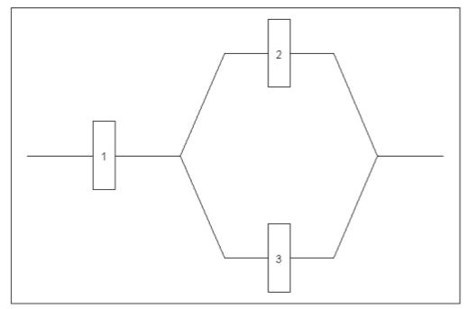

# Sets and Relations

```{r initial7, echo = FALSE, cache = FALSE, include = FALSE}
library(knitr)
opts_chunk$set(
  warning = FALSE,
  message = FALSE,
  echo = FALSE,
  fig.path = 'figure/',
  cache.path = 'cache/',
  fig.align = 'center',
  fig.show = 'hold',
  cache = TRUE,
  external = TRUE,
  dev = "png",
  fig.height = 16,
  fig.width = 10,
  out.width = "0.8\\textwidth"
)


library(tidyverse)
library(janitor)

```

\pagenumbering{arabic}

## Introduction

- Everyday we hear, or make statements to convey ideas about possibilities of occurring events.
    - Which lottery gives me the highest **chance** of winning?
    - What are **odds** of our cricket team winning the next world cup?
    - What is the **chance** of getting an A+ for CM1110?
- In order to make decisions or take actions, we need to **quantify the possibility** of occurrence of an event. For this, we use the term **probability**. 
- Probability is a **quantitative measure** of uncertainty, a **number** that conveys the strength of our belief in the occurrence of an uncertain event.
- The likelihood of an outcome is quantified by assigning a number from the interval [0, 1] to the outcome (or a percentage from 0 to 100%).
- Higher numbers indicate that the outcome is more likely than lower numbers. 
- A  probability of  0 indicates an outcome will not occur. 
- A probability of 1 indicates that an outcome will occur with certainty.

## Sample Spaces and Events

###	Random Experiments

- Statisticians use the word **experiment** to describe any process that generates a set of data. 
- An experiment usually involves observing or counting or measuring. For example; 
   -	we might classify items coming off an assembly line as defective or non-defective
   -	we may record the number of accidents that occur monthly at the Katubedda junction, hoping to justify the installation of a traffic light;
  -	 or we may be interested in the volume of gas released in a chemical reaction when the concentration of an acid is varied.
- An experiment that is repeatable in an identical fashion is called a **random experiment** or a **probability experiment**.
- Random experiment is an activity that leads to the occurrence of one of several possible outcomes which is not likely to be known until its completion, that is, the outcome is not perfectly predictable. This process has the properties that,
  -	All possible outcomes can be specified in advance.
  -	It can be repeated in an **identical manner.**
  -	The same outcome may not occur on various repetitions so that the actual outcome is not known in advance.
  
*Examples*

-	Tossing a coin. 
-	Throwing a die (or several dice)
-	Drawing cards from a pack
-	Launching of missile and observing its velocity at specified times.

### Outcomes

- The result of a **single experiment** is called an outcome.
- It can be instrument reading, counts, "yes" or "no" answers, values obtained through extensive calculations etc. 
- To model and analyze a random experiment, we must understand the set of possible outcomes from the experiment.

### Sample space

- The set of all possible outcomes of a random experiment is called the **sample space** of the experiment.
- We denote the sample space by $\Omega$. 
- Each outcome in a sample space is called an **element** of the sample space or simply a **sample point**. 

**Activity 01**
*Write down the corresponding sample space of the following experiments?*

**Example 01:** A player rolls a die.

```{r box71a, out.width='100%', fig.asp=.35, fig.align='center', fig.pos='h'}
#df<-data.frame(x = NULL, y = NULL)

ggplot()+
  theme_void()+
  theme(panel.border = element_rect(colour = "white", fill=NA, size=1))

```

**Example 02:** A player rolls two dice.

```{r box71b, out.width='100%', fig.asp=.35, fig.align='center', fig.pos='h'}
#df<-data.frame(x = NULL, y = NULL)

ggplot()+
  theme_void()+
  theme(panel.border = element_rect(colour = "white", fill=NA, size=1))

```

**Example 03:** A quality control engineer of a certain company takes a random sample of 4 products as the products come off its production line and counts the number of defective products in the sample.

```{r box71c, out.width='100%', fig.asp=.35, fig.align='center', fig.pos='h'}
#df<-data.frame(x = NULL, y = NULL)

ggplot()+
  theme_void()+
  theme(panel.border = element_rect(colour = "white", fill=NA, size=1))

```

**Example 04:** A quality control engineer of a certain company takes a random sample of 4 products as products come off its production line and determines whether each product is defective or non-defective

```{r box71d, out.width='100%', fig.asp=.35, fig.align='center', fig.pos='h'}
#df<-data.frame(x = NULL, y = NULL)

ggplot()+
  theme_void()+
  theme(panel.border = element_rect(colour = "white", fill=NA, size=1))

```

**Example 05:** A company produces a certain type of car batteries. If a battery has a voltage that is outside certain limits, that battery is characterized as bad (B); if the battery has a voltage within the prescribed limits it is characterized as good (G). A quality inspector selects batteries one by one as they come off the production line and tests them until he gets a bad battery. He uses this data to estimate the proportion of bad batteries produced by the company.

```{r box71e, out.width='100%', fig.asp=.35, fig.align='center', fig.pos='h'}
#df<-data.frame(x = NULL, y = NULL)

ggplot()+
  theme_void()+
  theme(panel.border = element_rect(colour = "white", fill=NA, size=1))

```

**Example 06:** An experiment consists of measuring the lifetime of a bulb.

```{r box71f, out.width='100%', fig.asp=.35, fig.align='center', fig.pos='h'}
#df<-data.frame(x = NULL, y = NULL)

ggplot()+
  theme_void()+
  theme(panel.border = element_rect(colour = "white", fill=NA, size=1))

```

- A sample space is often defined based on the objectives of the analysis. 
- The following example illustrates several alternatives

**Example:**

Consider an experiment that selects a digital camera and records the recycle time of a flash (the time taken to ready the camera for another flash). The possible values for recycle time can vary according to the resolution of the timer and on the minimum and maximum recycle times. 

However, since the time is positive we can define the sample space as simply the positive real line

***Case I***

***Case II*** If it is known that all recycle times are between 1.0 and 5.5 seconds, the sample space can be written as 

***Case III*** If the objective of the analysis is to consider only whether the recycle time is low, medium or high, the sample space can be written as a set of three outcomes


***Case IV*** If the objective is only to evaluate whether or not a particular camera confirms to a minimum recycle time specification, the sample space can be written as a set of two outcomes


- The number of outcomes in the sample space can be **finite** or **infinite**.
- Infinite sample spaces can be **countable** or **uncountable**.
- A sample space is countable if the outcomes can be associated with the integers $1, 2,3,\dots$.
- If the sample space contains a finite number of elements or an infinite though countable number of elements, it is said to be **discrete**. 
- The outcomes of some experiments are neither finite nor countably infinite, it is said to be **continuous**.  
- In the above Example, the choice $\Omega = \{x | x \geq   0\}$ is an example of a continuous sample space,
-  $\Omega = \{yes, no\}$ is a discrete sample space.
- As mentioned, the best choice of a sample space depends on the objectives of the study.

### Events as subsets of sample spaces

- **An event is a subset of the sample space of a random experiment**
-	Events are usually denoted by capital English letters A, B, C, D, E etc.
-	An event containing only one outcome is called a **simple event**.
-	An event containing more than one outcome is called a **compound event**.


**Activity 02**
*Express the following events as subsets of the sample spaces. Decide whether each event is simple or compound. (No need to calculate probabilities yet.)*

**Example 07:** A player rolls a die.

a)	A = the event of getting 3
b)	B = the event of getting an even number
c)	C = the event of getting a number less than 4
d)	D = the event of getting 2 or 5

```{r box72a, out.width='100%', fig.asp=.25, fig.align='center', fig.pos='h'}
#df<-data.frame(x = NULL, y = NULL)

ggplot()+
  theme_void()+
  theme(panel.border = element_rect(colour = "white", fill=NA, size=1))

```

**Example 08:** A player rolls two dice.

a)	A = The event that one number is even.
b)	B = The event that sum of the two numbers is odd
c)	C = The event that the numbers are equal
d)	D = The event of getting 2 and 5
e)	E = The event of getting 2 or 5

```{r box72b, out.width='100%', fig.asp=.35, fig.align='center', fig.pos='h'}
#df<-data.frame(x = NULL, y = NULL)

ggplot()+
  theme_void()+
  theme(panel.border = element_rect(colour = "white", fill=NA, size=1))

```

**Example 09:** Consider Example 03 in Activity 01,

a)	E = the event that sample contains more than 2 defective products.
b)	F = the event that the sample contains only two defective products.

```{r box72c, out.width='100%', fig.asp=.25, fig.align='center', fig.pos='h'}
#df<-data.frame(x = NULL, y = NULL)

ggplot()+
  theme_void()+
  theme(panel.border = element_rect(colour = "white", fill=NA, size=1))

```

**Example 10:** Consider Example 04 in Activity 01 

a)	G = the event that sample contains more than 2 defective products.
b)	H = the event that the sample contains two defective products.

```{r box72d, out.width='100%', fig.asp=.35, fig.align='center', fig.pos='h'}
#df<-data.frame(x = NULL, y = NULL)

ggplot()+
  theme_void()+
  theme(panel.border = element_rect(colour = "white", fill=NA, size=1))

```

**Example 11:** Consider Example 05 in Activity 01,

a)	I = the event that number of good batteries before a bad battery is 3.
b)	J = the event that the number of good batteries before a bad battery is less than 3.

```{r box72e, out.width='100%', fig.asp=.25, fig.align='center', fig.pos='h'}
#df<-data.frame(x = NULL, y = NULL)

ggplot()+
  theme_void()+
  theme(panel.border = element_rect(colour = "white", fill=NA, size=1))

```

**Example 12:** Consider Example 06 in Activity 01,

a)	A = the event that bulb burns for at least 25 hours but burns out before 50 hours.

```{r box72f, out.width='100%', fig.asp=.25, fig.align='center', fig.pos='h'}
#df<-data.frame(x = NULL, y = NULL)

ggplot()+
  theme_void()+
  theme(panel.border = element_rect(colour = "white", fill=NA, size=1))

```

## Event Operations

- We can describe new events from combinations of existing events.
- Because events are subsets, we can use basic set operations to form other events of interest. 
- Some of the basic set operations are summarized here in terms of events:

**Venn diagrams**

- Diagrams are often used to portray relationships between sets, and these diagrams are also used to describe relationships between events.
- We can use Venn diagrams to represent a sample space and events in a sample space.

###	Union

- Let A and B be two events. 
- The set of outcomes that belong to **either only A or only B or to both A and B,** is called the **union** of the two events. 
- It is denoted by $A \cup B$.
 
$$A \cup B = \{\omega\in \Omega: \omega \in A \text{ or } \omega\in B\}$$
```{r box71, out.width='100%', fig.asp=.35, fig.align='center', fig.pos='h'}
#df<-data.frame(x = NULL, y = NULL)

ggplot()+
  theme_void()+
  theme(panel.border = element_rect(colour = "black", fill=NA, size=1))

```
 
- Shaded set in the Venn diagram represents the event $A \cup B$

### Intersection

- Let A and B be two sets. 
- The set of outcomes that belong to **sets A and B both** is called the intersection of the two events.
- It is denoted by $A \cap B$.

 
$$A \cap B = \{\omega\in \Omega: \omega \in A \text{ and } \omega\in B\}$$

```{r box72, out.width='100%', fig.asp=.35, fig.align='center', fig.pos='h'}
#df<-data.frame(x = NULL, y = NULL)

ggplot()+
  theme_void()+
  theme(panel.border = element_rect(colour = "white", fill=NA, size=1))

```
 
- Shaded set in the Venn diagram represents the event $A \cap B$

#### Mutually exclusive events

- If the events A and B cannot occur together, in other words if $A \cap B$ cannot occur, then the events A and B are said to be **disjoint** or **mutually exclusive**.


```{r box73, out.width='100%', fig.asp=.35, fig.align='center', fig.pos='h'}
#df<-data.frame(x = NULL, y = NULL)

ggplot()+
  theme_void()+
  theme(panel.border = element_rect(colour = "white", fill=NA, size=1))

```


- If A and B are mutually exclusive, then we denote the intersection as
$$A \cap B = \{\} \text { or }  A \cap B = \phi.$$


### Complement

- The set of outcomes that are in sample space $(\Omega)$ but not in A is called the compliment of A. 
- It is denoted by $A^\prime$ or $A^c$ or $\bar{A}$ 

$$A^\prime = \{\omega \in \Omega: \omega \notin A\}.$$

```{r box74, out.width='100%', fig.asp=.35, fig.align='center', fig.pos='h'}
#df<-data.frame(x = NULL, y = NULL)

ggplot()+
  theme_void()+
  theme(panel.border = element_rect(colour = "white", fill=NA, size=1))

```

\newpage

\pagenumbering{arabic}

## Tutorial 

### Chapter 7: Sets and Relations {-}


1. Which of these sets are equal?

(a) $\{r,t,s\}$
(b) $\{s,t,r,s\}$
(c) $\{t,s,t,r\}$
(d) $\{s,r,s,t\}$)

i. Only b and d  are equal
ii. Only b,c and d are equal
iii. They are all equal
iv. None of them are equal


2. Let $A=\{1,3,5\}$ and $B=\{2,4,6\}$

Then

(a) $A\cap B = 0$
(b) $A\cap B = \phi$
(c) $A\cap B = \{\}$
(d) $A\cap B = \{1,2,3,4,5,6\}$)

i. Only d is correct
ii. Only b is correct
iii.  Only b and c are correct
iv.  Only a, b and c are correct


3. Find the elements of the set $A=\{\{1,2,3\}, \{4,5\}, \{6,7,8\}\}$ and determine whether each of the following is true or false

Statement  |   True  | False
-----------|---------|----------------
a. $1\in A$|         |
b. $\{1,2,3\}\subseteq A$|         |
c. $\{6,7,8\}\in A$|         |
d. $\{\{4,5\}\}\subseteq A$|         |
e. $\phi\in A$|         |
f. $\phi\subseteq A$|         |
g. $(4,5)\in A$|         |


4. A player rolls a die.

(a) What is the sample space of this experiment?
(b) Write down the following events as subsets of the sample space. Decide whether each event is simple or compound.

i. A = the event of getting 3
ii. B = the event of getting 7
iii. C = the event of getting a number less than 4
iv. D = the event of getting an even number
v. E = the event of getting 2 or 5


5. A player rolls two dies

(a) What is the sample space of this experiment?
(b) Write down the following events as subsets of the sample space. Decide whether each event is simple or compound.

i. A= the event that one number is even
ii. B= the event that sum of the two numbers is odd
iii. C= the event that the numbers are equal
iv. D= the event of getting 2 and 5
v. E= the event of getting 2 or 5

6. A player rolls three dies

(a) What is the sample space of this experiment? (Use set builder form of a set to represent the sample space)
(b) Write down the following events as subsets of the sample space. Decide whether each event is simple or compound

i. A = the event of getting all the numbers greater than 4
ii. B = the event that only two numbers are equal
iii. C = the event of getting two even numbers

7. A company produces a certain type of car batteries. If a battery has a voltage that is outside certain limits, that battery is characterized as bad (B); if the battery has a voltage within the prescribed limits it is characterized as good (G). A quality inspector selects batteries one by one as they come off the production line and tests them until he gets a bad battery. He uses this data to estimate the proportion of bad batteries produced by the company.

(a) What is the sample space of this experiment
(b) Write down the following events as subsets of the sample space. Decide whether each event is simple or compound.

i. I = the event that number of good batteries before a bad battery is 3.
ii. J = the event that the number of good batteries before a bad battery is less
than 3.

8. A doctor observes the lifetime of leukemia patients after being treated with a newly developed treatment.

(a) What is the sample space of this experiment?
(b) Write down the following event as subsets of the sample space. Decide whether it is
simple or compound.

i. K= the event that a randomly selected patient lives more than 10 years

9. Three students are selected at random from the class. Let 
P1 = the event that the first student pass
P2 = the event that the second student pass
P3 = the event that the third student pass Write the following events using the above events.

(a) The event that all three students pass
(b) The event that all three students fails
(c) The event that only 2 of the three students pass after the treatments

10. Identify the events of interest as subsets of the sample space. A box contains one ticket with number 1 on it, 2 tickets with number 2, 3 tickets with number 3, 4 tickets with number 4, 5 tickets with number 5, and 6 tickets with number 6. A ticket is taken randomly from the box

(a) A = The event of getting an even number?
(b) B = The event of getting a number less than 5?
(c) C = The event of getting an even number less than 5?
(d) Express C in terms of A and B using event operations
(e) ) D = The event of getting an even number or a number less than 5?
(f) Express D in terms of A and B using event operations
(g) Express, E= the event of getting an odd number, using the above defined event or events

11. Three components are connected to form a system as shown in figure (a). Because the components in the 2-3 subsystem are connected in parallel, that subsystem will function if at least one of the two individual components functions. For the entire system to function, component 1 must function and so must be 2-3 subsystem.


```{r   out.width = "80%", echo = FALSE, fig.align='center'}

```


Each component is either in working condition (s) or not working condition (f) at any time.
Let
$W1 =$ The event that component 1 is in working condition
$W2 =$ The event that component 2 is in working condition
$W3 =$ The event that component 3 is in working condition
$W =$ The event that the system is in working condition

(a) Write the above events as subsets of the sample space. (b) Write the following events.
i. $W3^\prime$
ii. $W1 \cap W2$
iii. $W2 \cup W3$
iv. $W1 \cap (W2 \cup W3)$
(c) Express $W$ in terms of $W1, W2$ and $W3$ using event operations.


12. Three products are selected at random, from a production line. Each product is either defective or non defective. Let
$D1 =$ The event that the first item is defective
$D2 =$ The event that the second item is defective
$D3 =$ The event that the third item is defective
$E =$ The event that two of the three products are defective Express E in terms of $D1, D2$ and $D3$ using event operations

