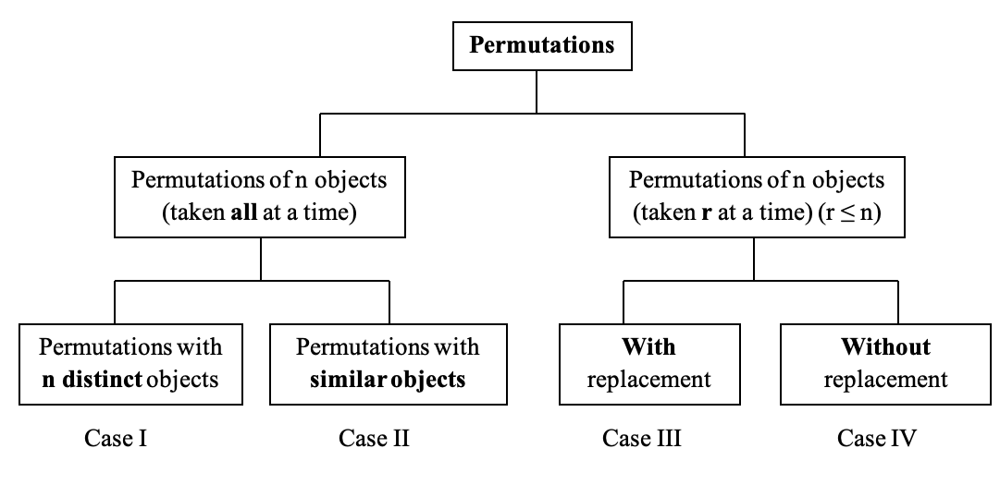
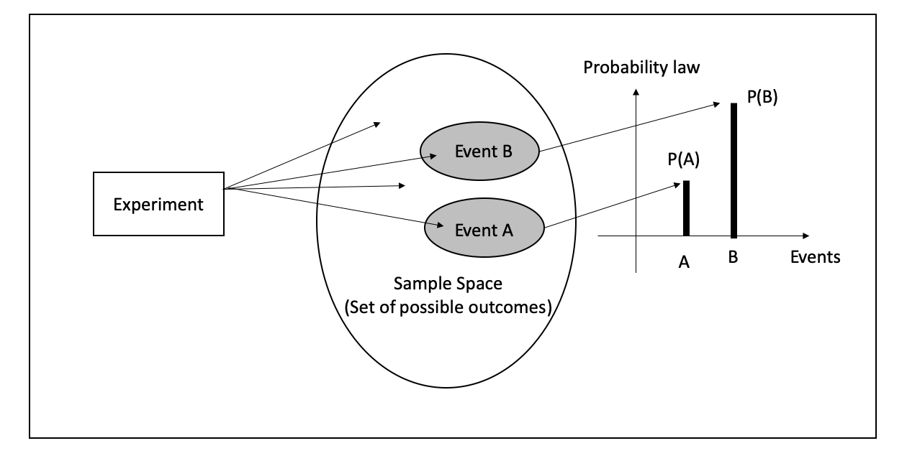
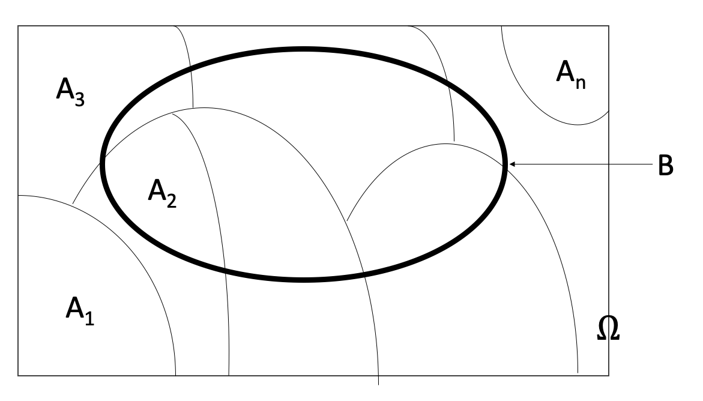

# Probability

```{r initial8, echo = FALSE, cache = FALSE, include = FALSE}
library(knitr)
opts_chunk$set(
  warning = FALSE,
  message = FALSE,
  echo = FALSE,
  fig.path = 'figure/',
  cache.path = 'cache/',
  fig.align = 'center',
  fig.show = 'hold',
  cache = TRUE,
  external = TRUE,
  dev = "png",
  fig.height = 16,
  fig.width = 10,
  out.width = "0.8\\textwidth"
)


library(tidyverse)
library(janitor)
library(tibble)

```

\pagenumbering{arabic}

## Counting Techniques

- This section develops some techniques for determining, without direct enumeration, the number of possible outcomes of a particular experiment or event or the number of elements in a particular set. 
- These methods are referred to as **counting techniques**. 

###  Basic Counting Principles
-	Sum Rule Principle
- Product Rule Principle / Multiplication Rule Principle

#### Sum Rule Principle 

**Example 1:** Suppose there are 8 male professors (say A, B, C, D, E, F, G and H) and 5 female professors (say J, K, L, M, N) teaching a language class. How many ways are there, a student can choose a language professor?

```{r box81, out.width='100%', fig.asp=.5, fig.align='center', fig.pos='h'}
#df<-data.frame(x = NULL, y = NULL)

ggplot()+
  theme_void()+
  theme(panel.border = element_rect(colour = "white", fill=NA, size=1))

```

**Example 2:** Suppose there are 3 different mystery novels, 5 different romance novels, and 4 different adventure novels on a bookshelf. How many different ways are there to choose one of the novels? 

```{r box82, out.width='100%', fig.asp=.5, fig.align='center', fig.pos='h'}
#df<-data.frame(x = NULL, y = NULL)

ggplot()+
  theme_void()+
  theme(panel.border = element_rect(colour = "white", fill=NA, size=1))

```

**Sum Rule Principle:** Suppose an event $E_1$ can occur in $n_1$ ways, a second event $E_2$ can occur in $n_2$ ways, a third event $E_3$ can occur in $n_3$ ways and so on, and suppose no two of the events can occur simultaneously (at the same time). Then one of the events can occur in $n_1 + n_2 + n_3 + \dots$ ways

*This principle can be stated in terms of sets as follows,*

**Sum Rule Principle:** Suppose $A$ and $B$ are mutually exclusive events (disjoint events). Then:      $$n(A \cup B)   = n(A) + n(B)$$

#### Product Rule Principle / Multiplication Rule

**Example 3:** The design for a Website is to consist of four colors, three fonts, and three positions for an image. Draw a tree diagram for the different types of designs.

```{r box83, out.width='100%', fig.asp=.5, fig.align='center', fig.pos='h'}
#df<-data.frame(x = NULL, y = NULL)

ggplot()+
  theme_void()+
  theme(panel.border = element_rect(colour = "white", fill=NA, size=1))

```
- How many different designs are possible?

- The above tree diagram describes the sample space of all possible designs. 
- The size of the sample space equals the number of branches in the last level of the tree, and this quantity equals $4 \times 3 \times 3 = 36$. - This leads to the following useful result.


**Product Rule Principle / Multiplication Rule:** Assume an operation can be described as a sequence of k steps, and
-	the number of ways of completing step 1 is $n_1$, and
-	the number of ways of completing step 2 is $n_2$ for each way of completing step 1, and
-	the number of ways of completing step 3 is $n_3$ for each way of completing step 2, and so forth.
The total number of ways of completing the operation is $n_1\times n_2 \times \dots \times n_k$


**Example  4:** Suppose a password consists of 4 characters, the first 2 being simple letters in the English alphabet and the last 2 being digits. Find the number of 

(a)	Passwords


(b)	Passwords beginning with a vowel


**Example 5:** There are 5 bus lines from city A to city B, 2 bus lines from city B to city C and  3 bus lines from city C to city D. Find the number of ways a person can travel by bus from city A to city D.


**Example 6:** There are five gates in a school. No student leaves the school from the gate he entered. Find the number of ways a student can enter and leave the school


### Factorial Notation

- The product of the positive integers from 1 to n inclusive occurs very often in mathematics and hence it is denoted by the special symbol $n!$, read "n factorial". That is
$$n! = 1\times2\times3\times \dots \times(n-2)\times(n-1)\times n = n\times (n-1)\times(n-2)\times\dots \times 3 \times 2 \times 1 $$

**NOTE**

$$0! = 1$$
$$1! = 1$$
**Examples 7:** 
(a) $2!=$	 
(b) $4!=$	 
(c) $\frac{8!}{6!}$ 
(d) Represent  $\frac{12.11.10}{3.2.1}$  in terms of factorial notation.


### Permutations

Permutation is an arrangement of all or part of a set of objects. Here the order is important


```{r   out.width = "100%", echo = FALSE, fig.align='center'}

```

#### Case I: Permutations of n distinct objects (taken all at a time)


**Example 8:** Find the number of "three-letter words (not necessary to have a meaning)" that can be formed using the letters of the word "TWO", without repetitions.


```{r box84, out.width='100%', fig.asp=.25, fig.align='center', fig.pos='h'}
#df<-data.frame(x = NULL, y = NULL)

ggplot()+
  theme_void()+
  theme(panel.border = element_rect(colour = "white", fill=NA, size=1))

```

Using multiplication rule:


```{r box85, out.width='100%', fig.asp=.25, fig.align='center', fig.pos='h'}
#df<-data.frame(x = NULL, y = NULL)

ggplot()+
  theme_void()+
  theme(panel.border = element_rect(colour = "white", fill=NA, size=1))

```


**Permutations of n distinct objects (taken all at time): **

*The number of permutations of n different elements is* $n!$ *where*
$$n! = n \times (n-1)\times(n-2)\times \dots \times 2 \times1$$

**NOTE**

- This result follows from the multiplication rule. - A permutation can be constructed by selecting the element to be placed in the first position of the sequence from the n elements, then selecting the element for the second position from the remaining $(n-1)$ elements, then selecting the element for the third position from the remaining $(n-2)$ elements, and so forth.


**Example 9:** Find the number of ways that 4 people can sit in a row of 4 seats 


```{r box86, out.width='100%', fig.asp=.25, fig.align='center', fig.pos='h'}
#df<-data.frame(x = NULL, y = NULL)

ggplot()+
  theme_void()+
  theme(panel.border = element_rect(colour = "white", fill=NA, size=1))

```


#### Case II: Permutations of similar objects (taken all at a time)

**Example 10:** Find the number of "three-letter words (not necessary to have a meaning)" that can be formed using the letters of the word "TOO".

```{r box87, out.width='100%', fig.asp=.25, fig.align='center', fig.pos='h'}
#df<-data.frame(x = NULL, y = NULL)

ggplot()+
  theme_void()+
  theme(panel.border = element_rect(colour = "white", fill=NA, size=1))

```

**Permutations of Similar Objects (taken all at a time):**

*The number of permutations of n* $(=n_1 + n_2 + n_3 + \dots + n_k)$ objects in which $n_1$ are alike, $n_2$ are alike, $\dots$, $n_k$ are alike, is 
 $$\frac{n!}{n_1!n_2!\dots n_k!}$$

**Example 11:** Find the number of "ten-letter words (not necessary to have a meaning)" that can be formed using the letters of the word "STATISTICS".

```{r box88, out.width='100%', fig.asp=.25, fig.align='center', fig.pos='h'}
#df<-data.frame(x = NULL, y = NULL)

ggplot()+
  theme_void()+
  theme(panel.border = element_rect(colour = "white", fill=NA, size=1))

```

- In some situations, we are interested in the number of arrangements of only some of the elements of a set. 
- Case III and Case IV address this particular situation.

#### Case III: Permutations of n objects taken r at a time (where $r\leq n$) (WITH Replacement) 

- Here the element is replaced in the set before the next element is chosen. 
- Since there are $n$ different ways to choose each element (repetitions are allowed), the product rule principle tells us that there are 
$$n.n.n\dots n = n^r$$
different ordered possibilities of size $r$.  


**Example 12:** How many "three digit numbers" can be made with the four digits 3, 5, 7 and 8 (A digit can be used as much as you can)

```{r box89, out.width='100%', fig.asp=.25, fig.align='center', fig.pos='h'}
#df<-data.frame(x = NULL, y = NULL)

ggplot()+
  theme_void()+
  theme(panel.border = element_rect(colour = "white", fill=NA, size=1))

```

#### Case IV: Permutations of n objects taken r at a time (where $r \leq n$) (WITHOUT Replacement) 


- Here the element is not replaced in the set before the next element is chosen. 
- Thus, there are no repetitions in the ordered sample.
- Accordingly, an ordered sample of size $r4 without replacement is simply an $r$ permutation of the elements in the set with $n$ elements. 
- In other words, by the product rule, the first element can be chosen in $n$ ways, the second in $(n-1)$ ways, and so on
$$n.(n-1)(n-2)\dots (n-r+1) = \frac{n.(n-1)(n-2)\dots (n-r+1).(n-r)!}{(n-r)!} = \frac{n!}{(n-r)!} = ^nP_r$$


**NOTE**

Consider the case that $n = r$. we get

$$^nP_r=\frac{n!}{(n-n)!} = \frac{n!}{0!} = \frac{n!}{1}=n!$$

**Example 13:** How many "three digit numbers" can be made with the four digits 3, 5, 7 and 8 (without repetition)

**Example 14:** A printed circuit board has eight different locations in which a component can be placed. If four different components are to be placed on the board, how many different designs are possible?


### Combinations

- Another counting problem of interest is the number of subsets of $r$ elements that can be selected from a set of $n$ elements. 
- These are called **combinations**. 
- Here, **order is not important**.

- For example, the combinations of the letters a, b, c, d taken three at a time are $\{a,b,c\}, \{a,b,d\}, \{a,c,d\}, \{b,c,d\}$  or simply $abc, abd, acd, bcd$
- Observe that the following combinations are equal:
$$abc, acb, bac, bca, cab, cba$$
- That is, each denotes the same set $\{a, b, c\}$.
- The number of combinations of $n$ objects taken $r$ at a time will be denoted by  $^nC_r$.

Before we derive the general formula for $^nC_r$ , we consider a particular case.


**Example:** Find the number of combinations of four objects a, b, c, d taken three at a time.

Combinations | Permutations
-------------|---------------------------
$\{a,b,c\}$  | 
$\{a,b,d\}$  | 
$\{a,c,d\}$  | 
$\{b,c,d\}$  |

- As can be seen in the above table, each combination consisting of three objects determines $3! = 6$ permutations of the objects in the combination. 
- Thus, the number of combinations multiplied by $3!$ equals the number of permutations.
- That is,
$$^4C_3\times 3! = ^4P_3$$
$$^4C_3 = \frac{^4P_3}{3!}$$
But we know $^4p_3 = \frac{4!}{(4-3)!}=\frac{4!}{1!} = 2.3.4 = 24$ and $3!=6$.

Thus
$$^4C_3 = \frac{24}{6} = 4$$
which is noted in the above table.


**Formula for** $^nC_r$

Since any combination of $n$ objects taken $r$ at a time determines $r!$ permutations of the objects in the combination, we can conclude that
$$^nC_r\times r! = ^nP_r.$$

Thus we obtain the following formula for $^nC_r$  as

$$^nC_r\times = \frac{^nP_r}{r!} = \frac{\frac{n!}{(n-r)!}}{r!} = \frac{n!}{r!(n-r)!}.$$

**Example 15:** In a small company there are 8 executive managers. How many ways are there to select 3 executive managers to form a new committee? 

```{r box891, out.width='100%', fig.asp=.25, fig.align='center', fig.pos='h'}
#df<-data.frame(x = NULL, y = NULL)

ggplot()+
  theme_void()+
  theme(panel.border = element_rect(colour = "white", fill=NA, size=1))

```

If Mr. Perera must be one of the 3, how many ways are there to form a new committee of 3?

```{r box891a, out.width='100%', fig.asp=.25, fig.align='center', fig.pos='h'}
#df<-data.frame(x = NULL, y = NULL)

ggplot()+
  theme_void()+
  theme(panel.border = element_rect(colour = "white", fill=NA, size=1))

```

**Example 16:**  A printed circuit board has eight different locations in which a component can be placed. If five identical components are to be placed on the board, how many different designs are possible?

```{r box892, out.width='100%', fig.asp=.25, fig.align='center', fig.pos='h'}
#df<-data.frame(x = NULL, y = NULL)

ggplot()+
  theme_void()+
  theme(panel.border = element_rect(colour = "white", fill=NA, size=1))

```

**Example 17:**  In a small company there are 7 women and 5 men. A committee of 3 women and 2 men are to be selected. How many different possibilities are there to select a committee?

```{r box893, out.width='100%', fig.asp=.25, fig.align='center', fig.pos='h'}
#df<-data.frame(x = NULL, y = NULL)

ggplot()+
  theme_void()+
  theme(panel.border = element_rect(colour = "white", fill=NA, size=1))

```


\newpage

### Summary {-}

**Sum Rule Principle:**

Suppose an event $E_1$ can occur in $n_1$ ways, a second event $E_2$ can occur in $n_2$ ways, a third event $E_3$ can occur in $n_3$ ways and so on, and suppose no two of the events can occur simultaneously (at the same time ).
Then one of the events can occur in $n_1 + n_2 + n_3 + \dots$ ways


**Product Rule Principle / Multiplication Rule**

Assume an operation can be described as a sequence of $k$ steps, and
-	the number of ways of completing step 1 is $n_1$, and
-	the number of ways of completing step 2 is $n_2$ for each way of completing step 1, and
- the number of ways of completing step 3 is $n_3$ for each way of completing step 2, and so forth.

The total number of ways of completing the operation is $n_1 \times n_2 \times \dots \times n_k$

**Permutations**

```{r   out.width = "100%", echo = FALSE, fig.align='center'}

```

$$n!\quad\quad \quad \quad \quad \quad  \frac{n!}{n_1!n_2!\dots n_k!}\quad\quad \quad \quad \quad \quad n^r\quad \quad \quad \quad  \quad \quad ^nP_r = \frac{n!}{(n-r)!}$$

**Number of combinations of $n$ objects taken** $r$ **at a time** $( r \leq n)$

$$^nC_r = \frac{n!}{r!(n-r)!}$$

## Axioms of probability

```{r   out.width = "100%", echo = FALSE, fig.align='center'}

```


- **Probability** of an event quantifies the **uncertainty**, randomness, or the possibility of occurrence the event. 
- The probability of event E is usually denoted by $P(E)$.
- Mathematically, the function $P(.)$ is a set function defined from sample space $(\Omega)$ to $[0, 1]$ interval, satisfying the following properties. 
- These are called the **'axioms of probability'**.

- **Axiom 1:** For any event $A$, $P(A) \geq 0$
- **Axiom 2:** $P(\Omega) = 1$
- **Axiom 3:** 
   - (a) If $A_1, A_2, \dots, A_k$ is a finite collection of mutually exclusive events, then \[P(A_1\cup A_2\cup \dots \cup A_k)= \sum_{i=1}^kP(A_i)\]
	   (b) If $A_1, A_2, \dots$ is an infinite collection of mutually exclusive events, then 
\[P(A_1\cup A_2\cup \dots)= \sum_{i=1}^\infty P(A_i)\]

**NOTE**

- Axioms 1 and 2 imply that for any event $E$, $0 \leq P (E) \leq 1$.
- $P (E) = 1 \iff$ the event E is certain to occur.
-	$P (E) = 1 \iff$ the event E cannot occur.

## Methods for determining Probability

- There are several ways for determining the probability of events. 
- Usually we use the following methods to obtain the probability of events.
    - Classical method
    - Relative frequency method (Empirical approach)
    - Subjective method
    - Using probability models

### Classical Method

- In the classical method, the probability of an event is calculated based on the sample space.
-	In this method no need to carry out any experiment. It is enough to know the sample space
-	Let $E$ be an event of the sample space $\Omega$. Suppose that 
       - the sample space is finite, and 
       - all the outcomes in the sample space are equally likely.

Then, the probability of event $E$ is given by

\[ P(E) = \frac{\text{Number of outcomes in E}}{\text{Number of outcomes in } \Omega} = \frac{n(E)}{n(\Omega)}\]


**NOTE:**

- For calculating probability using the classical method, knowledge on counting techniques is helpful.


**Activity 01**

Consider the following problems. Is it possible to use the classical method to calculate the probabilities of the event interest in these problems? Calculate the probabilities using classical method if possible.

(a)	A fair coin is tossed. What is the probability of getting a head?

(b)	Two fair dice are rolled. What is the probability that the sum of two numbers is odd?

(c)	A random sample of 4 products is taken from a production line. What is the probability that sample will contain more than 1 defective product?

(d)	The carton of 12 eggs is randomly selected. What is the probability that carton will have more than 4 brown eggs?

(e)	A one liter bottle of lemonade is selected randomly. What is the probability that the bottle will contain more than 900 ml?

(f)	What is the probability that at least 1 call will come to my mobile phone during the lecture?

**Activity 02**

A box contains 3 white balls and 2 black balls. Two balls are taken from this box. 

(a)	Write down the sample space 

(b)	Are the outcomes of your sample space equally likely?

(c)	Can you write the sample space so that outcomes will be equally likely?

(d)	Find the probability of getting one white ball and one black ball


### Relative frequency method (Empirical or objective approach)

- Consider an experiment that can be repeatedly performed in an identical and independent fashion, and let $E$ be an event consisting of a fixed set of outcomes of the experiment. 
- If the experiment is performed $k$ times, on some of the replications the event $E$ will occur, and on others, $E$ will not occur.                       
- Let $freq (E)$ be the number of replications on which $E$ occurs. 
-	Then the ratio   $\frac{freq (E)}k$    is called the **relative frequency** of event $E$ in a sequence of $k$ replications.
-	Empirical evidence, based on the results of many such sequences of repeatable experiments, indicates that the relative frequency stabilizes as $k$ is increased.
-	 This limiting relative frequency is equal to the probability of the event. That is,

\[P(E) = \lim \limits_{k \to \infty}\frac{freq(E)}{k}....................(1)\]


**Example**

- A population contained an unknown proportion of defective items
- The following experiment was repeated: one item was selected randomly, and determined whether it was defective or not.
-	An event $E$ was defined to have occurred if the selected item was defective.
-	The relative frequency of event $E$ was calculated at each replication.
- The following figure shows that the relative frequency stabilizes around 0.3.
-	Therefore, the probability of event $E$ is 0.3.

```{r rfrq, out.width='90%', fig.asp=0.7, fig.align='center'}
set.seed(194842)
n=25000
data <- sample(c(0,1), replace=TRUE, size=n, prob = c(0.7,0.3))

rfq <- purrr::map(1:n, function(x) sum(data[1:x])/x) %>% unlist()
 
plotdata <- tibble(k = 1:n, Rfrq = rfq)

p<- ggplot(plotdata, aes(k, Rfrq))+
  geom_point()+
  geom_line()+
  xlab("k=number of repetitions")+
  ylab("Relative Frequency")+
  ggtitle("Stabilization of relative frequency")

print(p)

```


- Therefore, the probability of an event $E$ related to a random experiment can be interpreted as the **"approximate proportion** of times that E occurs if we repeat the experiment **very large number of times"**.
- For example, the quality control engineer can say that the probability that a randomly selected product from his production process is defective with probability 0.3. 
- It means that if we examine **a very large number** of products from his production process, the proportion of defective items will be approximately $30\%$.
- The relative frequency notion of probability given by eq. (1), is not practically applicable directly because in order to determine the probability we need to do the experiment *infinitely many times*.
- However, as we can see from above graph the relative frequency is approximately equal to the limit when $k$ is **large** enough. 
- Therefore we can use the relative frequency notion to obtain an **'estimate'** for the probability of the event $E$.
- That is, if the number of trials, $k$, is sufficiently large, then the observed relative frequency becomes close to the probability $P(E)$, or
 
 \[P(E) \approx \frac{\text{Number of times the event E occurs}}{\text{Number of trials}}= \frac{freq(E)}{k}\]

- This idea is used in practice, by using large data sets to estimate probability. 
- Such probability is called **empirical probability**.
- This is also referred to as an **objective approach** because it depends on a property of the experiment rather than any particular individual concerned with the experiment.


**Activity 03**

In a large manufacturing company, there are 2500 employees. An opinion survey was conducted on 960 randomly selected employees regarding three types of bonus schemes. Employees were divided into four categories, namely, laborers, clerical, technical and executives. The results obtained by ways of opinion survey are presented in the following table.

Bonus scheme |	Laborer |	Clerk|	Technician|	Executive	|	Total
-------------|----------|------|------------|----------|-------------	
Type X |	190	| 82 |	23| 	5	|
Type Y | 243	| 44 | 78	| 12	|
Type Z | 197	| 44 |	34 |	8	|
Total	 |			|	  |  |  | 

Let

   X be the even that a randomly selected employee with type X bonus scheme
   Y be the even that a randomly selected employee with type Y bonus scheme
   Z be the even that a randomly selected employee with type Z bonus scheme

Let

   L be the event that a randomly selected employee is a Laborer
   C be the event that a randomly selected employee is a Clerk
   T be the event that a randomly selected employee is a Technician
   E be the event that a randomly selected employee is an Executive

I.	Then write the following events in words
   (a) $C^\prime$
   (b) $C \cap X$
   (e) $L \cup T$
   (d) $C^\prime \cap Z$ 

II.	 If a sample is selected at random, determine the following probabilities:
 
   (a) $P(X)$ 
   (b) $P(L)$
   (c) $P(C^\prime)$
   (d) $P(C \cap X)$
   (e) $P( L \cup T)$ 
   (f) $P(C^\prime \cap Z)$	
   
### Subjective method

-	A subjective probability reflects a person’s opinion about the likelihood of an event. 
- These probabilities are personal and they will differ between people. 
-	Assigning subjective probabilities to events is hard as these guesses are often based on their personal experiences and evaluation of related facts.
-	Subjective interpretation of probability is used for problems in which it is difficult to imagine a repetition of an experiment.
-	These are 'one shot' situations.
- For example,
    - A sports writer may say that the probability that Sri Lanka will win the next T20 World Cup is 0.6
  	- A surgeon may guess that the probability of recovery after a heart surgery  for certain person is about 0.5
    - A seismologist might say that there is an 80% probability that an earthquake will occur in a certain area
-	One major shortcoming of subjective probability is that the probability of the same event can vary from person to person and the accuracy of these probabilities cannot be checked.


### Using probability models

- In this method, the event of interest is expressed in terms of a "random variable" and the probability is calculated using a suitable mathematical function derived based on data. This method will be discussed later.

##  Conditional Probability

- Let $A$ be an event of the sample space $\Omega$ of an experiment. 
- Then $P(A)$ is called the unconditional probability or simply the probability of event $A$. - Then, $P(A)$ is equal to the sum of probability of each outcome in $A$.

- Now suppose that the experiment has been carried out and we are told that the outcome is an element of another event $B$ (But we are not told the exact outcome). 
- In other words, we are told that event $B$ has occurred. Then, what is the probability that event $A$ has occurred?
- The probability of an event $A$ occurring when it is known that some event $B$ has occurred is called a **conditional probability** and is denoted by $P(A|B)$.
- The symbol $P(A|B)$ is usually read **"the probability that A occurs given that B occurs"** or simply **"the probability of A, given B."**


**Activity 01**

A box contains 3 white balls and 2 black balls. Two balls are taken one after the other without replacement. 

  a)	What is the probability that the first ball is white?
  b)	If the first ball is white, what is the probability that the second ball is black?
  c)	Show all the possible outcomes and probabilities of the above experiment in a tree diagram.
  d)	Identify the unconditional probabilities and conditional probabilities from the given information. 
  e)	What is the probability that the second ball is black?


**Definition - Conditional Probability**

**Let A and B be two events. The probability that event A occurs given that event B has occurred is called the conditional probability of A given B. It is denoted by** $P(A|B)$ **and defined as**
\[P(A|B) = \frac{P(A ∩ B)}{P(B)}, \text{ when }P(B) \neq 0\]

### Independent events

- Two events A and B are said to be independent, if the occurrence of A does not depend on the occurrence of B.

\[\text{A and B are independent} \iff P(A|B) = P(A) \text{ and } P(B|A) = P(B)\]

**Activity 02** 

A box contains 3 white balls and 2 black balls. Two balls are taken one after the other with replacement. 

  a)	What is the probability that the first ball is white?
  b)	If the first ball is white, what is the probability that the second ball is black?
  c)	If the first ball is black, what is the probability that the second ball is black?
  d)	What is the probability that the second ball is black?
  
## Rules of Probability

- Probability rules are used for calculating the probabilities of events that are expressed in terms of other events with set operations.

### Complement rule

- Let $E$ be an event, Then $P(E^\prime) = 1 –P(E)$

### Addition rule

- Let $A$ and $B$ are two events. Then, 
\[P(A \cup B) = P(A) + P(B) – P(A \cap B)\]
- If $A$ and $B$ are mutually exclusive, then $P(A \cap B) = 0$ and, therefore, 
\[P(A \cup B) = P(A) + P(B)\]

### Multiplication rule

- Let $A$ and $B$ be two events. Then,
\[P(A \cap B) = P(A|B)P(B) = P(B|A)P(A)\]
\[\text{A and B are independent } \iff P(A|B) = P(A) \text{ and } P(B|A) = P(B)\]
\[\text{A and B are independent} \iff P(A \cap B) = P(A) P(B)\]


### The law of total probability

```{r   out.width = "70%", echo = FALSE, fig.align='center'}

```
 \[A_1\cup A_2\cup \dots \cup A_n = \Omega, \text{ all mutually disjoint}\]
 
- Let $A_1, A_2, \dots A_n$ be mutually exclusive and exhaustive events. Then, for any event $B$,
\[P(B) = P(B \cap A_1) + P(B \cap A_2) + \dots + P(B \cap A_n)\]
\[P(B) = P(B|A_1) P(A_1) + P(B|A_2) P(A_2) +\dots+ P(B|A_n) P(A_n)\]

## Bayes' Theorem

- Let $A_1, A_2, \dots,A_n$ be mutually exclusive and exhaustive events, and $B$ be any event. 

Then for $i = 1, 2, \dots, n$.

\[P(A_i|B) = \frac{P(A_i \cap B)}{P(B)}\]

\[P(A_i|B) = \frac{P(B|A_i)P(A_i)}{P(B)}\]


\newpage


## Tutorial 

### Chapter 8: Probability {-}

1. A professor is giving ten true-false questions (10 marks for a correct answer). If a student guesses on each question, how many different ways could the ten questions be answered?


2. A security supervisor of a large corporation wishes to issue each employee an identity card with one English letter followed by two digits.

(a) How many different ID cards could be made
(b) How many identity cards will have the same two numbers
(c) How many identity cards will have first number greater than the second number

3. In a small company there are 5 executive managers. Two of them are males and 3 are females. Three executive managers are to be selected for a committee.

a.	How many different ways are there to select three executive managers for the committee?
b.	How many different ways are there to select three executive managers for the committee while satisfying the following conditions?
   i.	All in the committee will be females
   ii. Two will be females and one will be     a male
   iii.	Two will be males and one will be a female