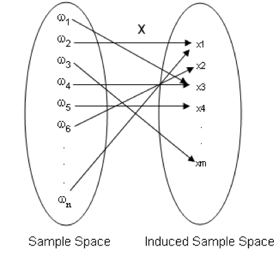

\pagenumbering{arabic}
# Random Variables


```{r initial9, echo = FALSE, cache = FALSE, include = FALSE}
library(knitr)
opts_chunk$set(
  warning = FALSE,
  message = FALSE,
  echo = FALSE,
  fig.path = 'figure/',
  cache.path = 'cache/',
  fig.align = 'center',
  fig.show = 'hold',
  cache = FALSE,
  external = TRUE,
  dev = "png",
  fig.height = 5,
  fig.width = 10
)


library(tidyverse)

```


-	Some sample spaces contain quantitative (numerical) outcomes, others contain qualitative outcomes.
-	Often it is convenient to work with sample spaces containing numerical outcomes.
-	A function that maps the original sample space into the real numbers is called a 'random variable'.
-	This is more useful when the original sample space contains qualitative outcomes.

**Definition 1: Random Variable**

Let $\Omega$ be a sample space. Let $X$ be a function from $\Omega$  to $\Re$ (*i.e.* $X:\Omega \rightarrow \Re$). Then $X$ is called a random variable.

<!--**random variable** is a function from a sample space $S$ into the real numbers (*i.e.* $X:S \rightarrow \Re$)-->

```{r   out.width = "50%", echo = FALSE, fig.align='center'}

```

- A random variable assigns a real number to each outcome of a sample space.
-	In other words, to each outcome of an experiment or a sample point $\omega_i$, of the sample spaces, there is a unique real number $x_i$, known as the value of the random variable $X$.
- The range of the random variable is called the *induced sample space*. 
- *A note on notation:* Random variables will always denoted with uppercase letters and the realized values of the random variable (or its range) will be denoted by the corresponding lowercase letters. Thus, the random variable $X$ can take the value $x$. 
- Each outcome of a sample space occurs with a certain probability. Therefore,  each possible value of a random variable is associated with a probability. 
- Any events of a sample space can be written in terms of a suitably defined random variable. 

## Types of Random Variables

- A random variable is of two types
  - Discrete Random Variable
  - Continuous Random Variable

## Discrete Random Variable

- If the induced sample space is discrete, then the random variable is called a **discrete random variable**.
<!--- A random variable ($X$) is said to be discrete if it takes only a finite; or an infinite but countable number of values.-->
<!-- Examples: The following are discrete random variables:
  -	Number of children per family 
  -	Attendance of CM 2110 lectures
  -	GPA credit value that you can obtain for CM 2110
  -	The number of machine breakdowns during a given day in a company
-->

*Example 01*
Consider the experiment of tossing a coin.  Express the following events using a suitably defined random variable

$H=$ *The event of getting a head*

$T=$ *The event of getting a tail*

```{r Ch1box1, out.width='100%', fig.asp=.9, fig.align='center', fig.pos='h'}
library(ggplot2)

ggplot()+
  theme_void()+
  theme(panel.border = element_rect(colour = "white", fill=NA, size=1))

```

*Example 02*

Consider the experiment of rolling of a die.  Express the following events using a suitably defined random variable

$A=$ *The event that the number faced up is less than 5*

$B=$ *The event that the number faced up is even*

$C=$ *The event that the number faced up is 2 or 5*

```{r Ch1box2, out.width='100%', fig.asp=.9, fig.align='center', fig.pos='h'}
library(ggplot2)

ggplot()+
  theme_void()+
  theme(panel.border = element_rect(colour = "white", fill=NA, size=1))

```

\newpage

*Example 03*

Consider the experiment of tossing a coin 10 times. Then the sample space $\Omega$ contains $2^{10} = 1024$ outcomes. Each outcome is a sequence of 10 H's and T's.

Express the following events in terms of a suitably defined random variable.

$D=$ *The event that the number of heads is 5*

$E=$ *The event that the number of tails is less than 4*

 
```{r Ch1box3, out.width='100%', fig.asp=.9, fig.align='center', fig.pos='h'}
library(ggplot2)

ggplot()+
  theme_void()+
  theme(panel.border = element_rect(colour = "white", fill=NA, size=1))

```

## Continuous Random Variable

- If the induced sample space is continuous, then the random variable is called a **continuous random variable.**
<!--- A continuous random variable is a random variable that can take on any value in a given interval.
-	Random variables which consist of measurements are usually continuous. 
- For example
  -	height of a student in this class 
  -	the current measured in a thin copper wire in milliamperes
  -	Life time of a mobile phone battery
  -	SGPA of a level 2 student
-->

*Example 04*

Consider the experiment of measuring the lifetime (in hours) of a randomly selected bulb.  Express the following events in terms of a suitably defined random variable. 
 
$F=$ *The event that the lifetime is less than 300 hours*

$G=$ *The event that the lifetime is 1000 hours*

```{r Ch1box4, out.width='100%', fig.asp=.7, fig.align='center', fig.pos='h'}
library(ggplot2)

ggplot()+
  theme_void()+
  theme(panel.border = element_rect(colour = "white", fill=NA, size=1))

```

## References {-}

Casella, G., & Berger, R. L. (2002). Statistical inference (Vol. 2, pp. 337-472).Pacific Grove, CA: Duxbury

Mood, A.M., Graybill, F.A. and Boes, D.C. (2007): Introduction to the Theory of Statistics, 3rd Edn. (Reprint). Tata McGraw-Hill Pub. Co. Ltd.

